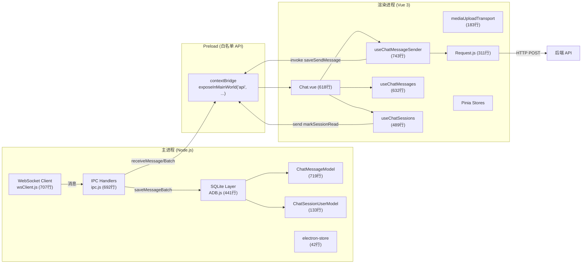
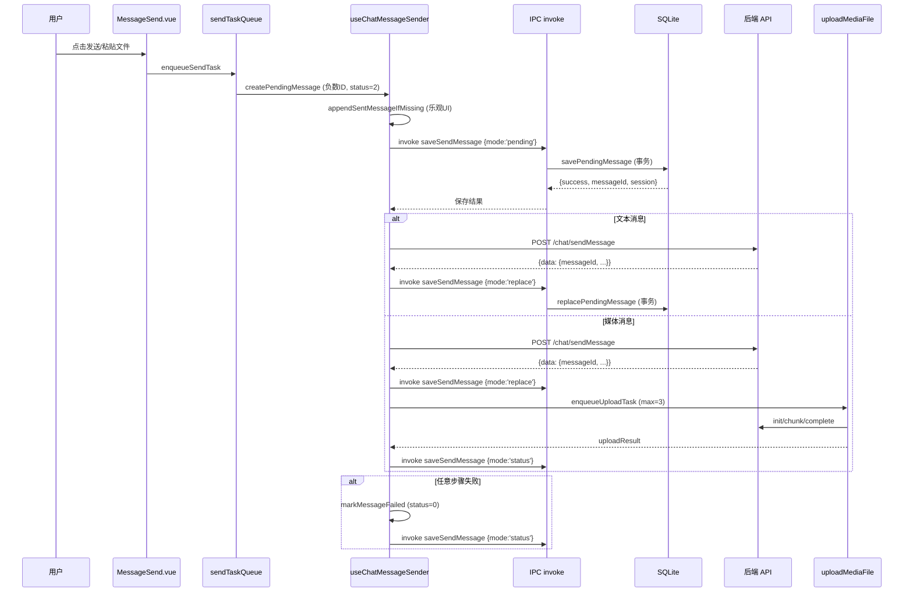
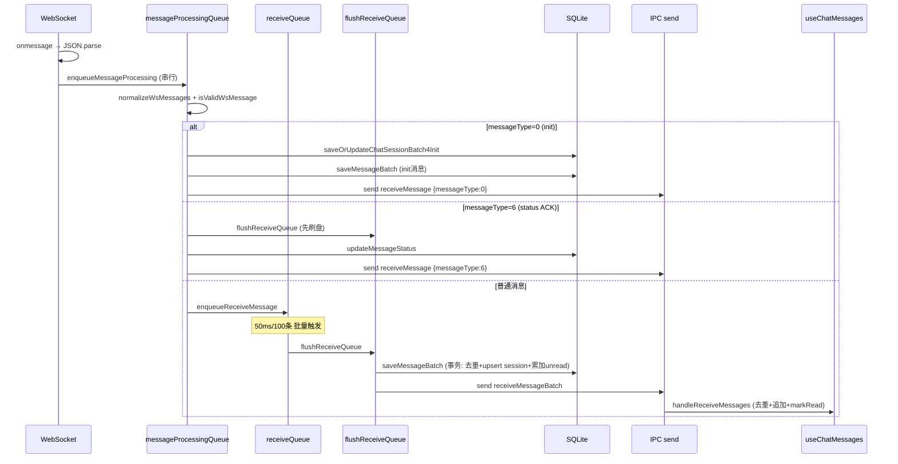

# EasyChat 全面工程审计与优化建议

> 审计日期: 2026-06-11（P0 修复后更新）
> 审计范围: 架构与代码质量、聊天链路、稳定性与健壮性、性能、用户体验、安全与隐私、测试与工程化
> 审计方式: 本地代码只读审计 + 成熟桌面 IM 模式级对标
> 项目版本: aaf5071 (2026-06-11) → P0 修复后
> 代码规模: ~84 个源文件, ~6,500 行核心业务代码
> P0 修复状态: **4/4 已修复** ✅（2026-06-11 完成）

---

## 一、执行摘要与总体健康评分

EasyChat 是一个基于 Electron 34 + Vue 3 + Pinia + SQLite 的桌面 IM 客户端，目标对标微信桌面版的聊天体验。项目当前处于"从功能开发转向稳定性加固"阶段。

### 总体评分: 3.8 / 5.0（P0 修复后从 3.4 提升）

| 维度 | 评分 | 趋势 | 说明 |
|------|------|------|------|
| 架构与代码质量 | 3.8/5 | ↑ | 职责边界清晰，composable 模式拆分合理，preload 白名单 API 模式已建立 |
| 聊天链路稳定性 | 3.8/5 | ↑ | 发送/接收主干已具备本地优先、批量落库、去重等能力，replace 失败已有补偿 |
| 稳定性与健壮性 | 3.4/5 | ↑ | DB 读错误已显式传播，IPC handler 错误闭环改善，但 WS 半开、IPC 回调丢失等缺口仍存 |
| 性能 | 3.2/5 | → | 常规场景可接受，缺少大数据量、长会话、高频消息的系统性优化 |
| 用户体验 | 2.8/5 | → | 核心功能完整，但状态反馈、错误提示、空状态/加载态与微信差距明显 |
| 安全与隐私 | 3.5/5 | ↑ | sandbox 已启用、preload 白名单已建立，但 token 明文、DB 无加密仍需处理 |
| 测试与工程化 | 3.2/5 | ↑ | 16 个测试文件 + 214 个测试用例全部通过，renderer 测试已迁移到 window.api mock |

### 最重要的五个问题（P0 修复后更新）

| # | 级别 | 问题 | 影响 | 状态 |
|---|------|------|------|------|
| 1 | ~~P0~~ | ~~sandbox: false + preload 回退绕过 contextBridge~~ | ~~RCE 风险~~ | ✅ 已修复 |
| 2 | ~~P0~~ | ~~DB 读错误被调用方伪装为空数据~~ | ~~故障掩盖~~ | ✅ 已修复 |
| 3 | ~~P0~~ | ~~HTTP 成功但本地 replace 失败缺恢复~~ | ~~消息状态错乱~~ | ✅ 已修复 |
| 4 | **P1** | WebSocket 重连后 receive queue 溢出无补偿拉取 | 高峰消息可能永久丢失本地历史 | 待修复 |
| 5 | **P1** | 无日志框架，生产环境无可追溯诊断 | 线上问题无法定位和复盘 | 待修复 |

---

## 二、系统架构图与聊天链路图

### 2.1 进程架构



### 2.2 消息发送链路



### 2.3 消息接收链路



---

## 三、已确认 Bug 清单

### 3.1 P0 级别 — 已全部修复 ✅

#### BUG-P0-1: sandbox: false 导致渲染进程可执行任意 Node.js API ✅ 已修复

- **文件**: `src/main/index.js` L49
- **现象**: `webPreferences.sandbox: false`，渲染进程在 preload 脚本中可访问完整 Node.js API
- **触发条件**: 始终触发
- **用户/系统影响**: 若渲染进程存在 XSS 漏洞（如未过滤的用户输入渲染为 HTML），攻击者可执行任意系统命令、读写文件、访问网络
- **根因分析**: Electron sandbox 默认关闭。项目依赖 `contextIsolation: true` 做隔离，但 `sandbox: false` 仍允许 preload 脚本使用 Node.js API，且 preload 回退路径（见 BUG-P0-2）绕过了 contextBridge
- **修复方案**:
  1. 设置 `sandbox: true`
  2. 将所有 Node.js API 调用从 preload 迁移到 main 进程 IPC handler
  3. 确保 preload 只通过 `contextBridge.exposeInMainWorld` 暴露白名单 API
- **实际修复**:
  1. ✅ `src/main/index.js`: `sandbox: false` → `sandbox: true`
  2. ✅ `src/preload/index.js`: 完全重写为白名单 API 模式
     - 仅通过 `contextBridge.exposeInMainWorld('api', {...})` 暴露命名方法 API（如 `sendLoadSessionData()`, `invokeSaveSendMessage()`, `onReceiveMessage()` 等）
     - 不再暴露完整 `ipcRenderer` 对象
     - 事件回调只传业务数据，不向 renderer 暴露 `IpcRendererEvent`；订阅方法返回精确清理函数
  3. ✅ 所有 13 个 renderer 文件从 `window.electron.ipcRenderer.xxx()` 迁移到 `window.api.xxx()`
     - Login.vue, WinOp.vue, UserInfo.vue, UserInfoPassword.vue
     - Chat.vue, ChatMessageSearchDialog.vue
     - FileManage.vue
     - Request.js
     - useChatMessageSender.js, useChatMessages.js, useChatSessions.js
     - useFileTransfer.js, useMessageComposer.js
- **回归测试**: 启动应用后验证所有功能正常，检查 `window.require`、`window.process` 在 DevTools 中不可用
- **分类**: 已确认问题 → 已修复

#### BUG-P0-2: Preload 回退路径绕过 contextBridge ✅ 已修复

- **文件**: `src/preload/index.js` L25-28
- **现象**: 当 `contextIsolation` 为 false 时，直接将 `electronAPI`（含完整 `ipcRenderer`）挂载到 `window`
- **触发条件**: `process.contextIsolated` 返回 false 的环境
- **用户/系统影响**: 渲染进程可直接调用 `ipcRenderer.send` 任意通道，绕过白名单
- **根因分析**: 兼容性回退代码，但实际上 `contextIsolation: true` 已硬编码，此路径不应被执行
- **实际修复**:
  - ✅ 移除 else 分支，替换为 `console.error('contextIsolation is disabled — refusing to expose IPC APIs')`
  - 不再在非隔离环境下暴露任何 API，彻底杜绝绕过路径
- **回归测试**: 确保 `contextIsolation: true` 下功能正常
- **分类**: 已确认问题 → 已修复

#### BUG-P0-3: DB 读错误被调用方伪装为空数据 ✅ 已修复

- **文件**: `src/main/db/ADB.js` (queryAll/queryOne/queryCount) + `src/main/ipc.js` (各 handler)
- **现象**: 虽然 ADB 层 `queryAll`/`queryOne`/`queryCount` 现在正确地 reject 错误，但上层 IPC handler 未统一捕获，导致错误被 `registerSafeIpcOn` 的 catch 路径以非标准格式返回给 renderer
- **代码证据**:
  - `onLoadSessionData` handler 直接 `await selectUserSessionList()` 无 try/catch
  - `onLoadChatMessage` handler 直接 `await selectMessageList(data)` 无 try/catch
  - `onSearchChatMessage` handler 直接 `await searchMessageBySessionId(data)` 无 try/catch
- **触发条件**: SQLite 文件损坏、磁盘满、权限异常
- **用户/系统影响**: 用户看到空会话列表，误以为没有聊天记录，实际是数据库不可用
- **实际修复**:
  1. ✅ `src/main/ipc.js`: `onLoadSessionData`、`onLoadChatMessage`、`onSearchChatMessage` 三个 handler 均增加 try/catch
     - DB 查询失败时通过 `buildIpcErrorPayload()` 构造标准错误格式返回
     - 保留 `sessionId`、`loadSeq` 等上下文信息，方便 renderer 防串线校验
  2. ✅ `src/renderer/.../useChatSessions.js`: `loadSessionDataHandler` 增强错误检查
     - 中文错误提示："会话列表加载失败，数据库可能不可用。"
     - DB 错误不再被误当作空列表处理
- **回归测试**: 模拟 DB 初始化失败，验证 UI 显示错误而非空列表
- **分类**: 已确认问题 → 已修复

#### BUG-P0-4: HTTP 成功但本地 replace 失败缺恢复 ✅ 已修复

- **文件**: `src/renderer/src/views/chat/composables/useChatMessageSender.js` L266-282
- **现象**: 消息发送到服务端成功，但 `replacePendingMessage` IPC 调用失败时，本地仍保留负数 messageId 的 pending 记录
- **触发条件**: SQLite 写入错误、IPC 通信中断
- **用户/系统影响**: 重启后，pending 消息可能被 `recoverStalePendingMessages` 转为 failed（status=0），用户看到已成功发送的消息显示为失败
- **实际修复**:
  1. ✅ `useChatMessageSender.js`: `markMessageLocalSyncFailed` 增加 `scheduleLocalSyncRetry` 后台重试机制
     - 指数退避：2s → 4s → 6s，最多重试 3 次
     - 每次重试调用 `persistServerMessage` 尝试 replace
     - 重试成功时自动更新 UI 状态（`status=1`, `localSyncFailed=false`）
     - `localSyncRetryTimers` 数组跟踪所有定时器，`cleanupUploadControllers` 中统一清理
  2. ✅ `ipc.js`: replace 写库异常时把完整替换 payload 写入按用户隔离的 `electron-store` 恢复队列
     - 队列按本地/服务端 messageId 去重，最多保留 100 条
     - replace 成功后自动移除对应恢复项
  3. ✅ `ipc.js`: 登录启动时先重放持久恢复队列，再执行 stale pending 恢复
     - 保留服务端 messageId 和完整消息数据，可真正完成跨重启 replace
     - 媒体消息在内存重试成功后继续文件上传，不再停留在“已创建但未上传”
- **回归测试**: 模拟 `replacePendingMessage` 失败，验证后台重试自动修复；重启后验证补偿机制
- **分类**: 已确认问题 → 已修复

### 3.2 P1 级别 — 稳定性和体验修复

#### BUG-P1-1: Receive queue 溢出后无自动补偿拉取

- **文件**: `src/main/wsClient.js` L392-408
- **现象**: 当 receiveQueue 超过 `RECEIVE_QUEUE_MAX` (2000) 时，丢弃最老消息并通知 renderer，但不会主动从服务端拉取丢失的消息
- **触发条件**: 高并发消息场景（群聊刷屏 + 网络波动）
- **用户/系统影响**: 丢弃的消息永久缺失本地历史，除非用户手动滚动触发分页
- **根因分析**: `publishReceiveRecoveryNeeded` 发出通知但无后续拉取动作。renderer 侧 `recoverReceiveResync` 仅做 `loadChatMessage({refreshTail:true})`，不会补全中间缺口
- **修复方案**:
  1. 溢出后按 session 标记 `needsHistorySync`
  2. 重连 init 时或空闲时触发按 session 历史拉取
  3. 参考 Signal Desktop 的 "gap fill" 机制
- **回归测试**: 发送 2000+ 条消息，验证溢出后重新拉取缺失消息
- **分类**: 已确认问题

#### BUG-P1-2: 重连前 flush 不等待确认

- **文件**: `src/main/wsClient.js` L148-155
- **代码**: `saveAndPublishMessageBatch(pending).catch(...)` — 异步不等待
- **现象**: `resetWsRuntime` 时将队列中消息异步刷盘但不等待完成，generation 递增后 renderer push 被丢弃
- **触发条件**: 重连/登出时有未刷盘的消息
- **用户/系统影响**: 消息已入库但 UI 未更新，需等重连后 init 补推
- **修复方案**: 改为 `await` 或至少在 closeWs 中等待
- **分类**: 潜在风险

#### BUG-P1-3: 上传任务无全局超时

- **文件**: `src/renderer/src/views/chat/composables/mediaUploadTransport.js`
- **现象**: 单个 chunk 有超时（chunkUploadTimeout），但整个上传流程（init + N*chunk + complete）无总超时
- **触发条件**: 大文件分片上传，chunk 间歇性失败导致重试后总时间很长
- **用户/系统影响**: 上传卡住时长期占用并发槽，后续上传被拖慢
- **修复方案**: 为整个上传流程增加总超时（如 30 分钟），超时后 abort 并标记失败
- **分类**: 潜在风险

#### BUG-P1-4: 媒体重试依赖内存 retryFile，重启后丢失

- **文件**: `src/renderer/src/views/chat/composables/useChatMessageSender.js` L499
- **代码**: `localMessage.retryFile = file`
- **现象**: 媒体上传失败后，`retryFile` 仅为内存中的 File 对象引用
- **触发条件**: 媒体上传失败 → 用户重启应用 → 点重试
- **用户/系统影响**: 重启后无法重试上传，用户看到 "This file can only be retried before the app is restarted."
- **修复方案**:
  1. 存储文件路径而非 File 对象，重试时从路径读取
  2. 或在 IPC 层缓存文件到临时目录
- **分类**: 已确认问题（已有用户提示，但体验差）

#### BUG-P1-5: markSessionRead 回滚竞态

- **文件**: `src/renderer/src/views/chat/composables/useChatSessions.js` L374-430
- **现象**: 5 秒超时回滚依赖 `_readGeneration` 匹配，但如果超时前有新的 `patchChatSessions` 更新了 `_readGeneration`，回滚会跳过
- **触发条件**: mark read → 5s 内收到该 session 的新消息 patch → mark read 回调超时
- **用户/系统影响**: unread 可能永久显示 0（已通过 generation 缓解，但仍有边缘场景）
- **修复方案**: 引入操作 ID，回滚只匹配对应操作 ID
- **分类**: 潜在风险

#### BUG-P1-6: 无日志框架，生产环境无可追溯诊断

- **文件**: 全局
- **现象**: 仅使用 `console.log/error/warn`，生产环境无日志持久化、级别过滤、轮转和上传
- **触发条件**: 线上问题发生时
- **用户/系统影响**: 无法定位问题根因，只能让用户复现
- **修复方案**: 引入 `electron-log` 或类似库，配置日志轮转和级别过滤
- **分类**: 优化建议

#### BUG-P1-7: Token 通过 WS URL 参数传输

- **文件**: `src/main/wsClient.js` L506
- **代码**: `wsUrl = \`${wsDomain}?token=${config.token}\``
- **现象**: 认证 token 作为 query string 拼接到 WebSocket URL
- **触发条件**: 始终触发
- **用户/系统影响**: token 可被代理服务器、CDN、浏览器历史、服务端访问日志捕获
- **修复方案**:
  1. 首条 WS 消息发送认证 payload
  2. 或使用 `Sec-WebSocket-Protocol` header 传递 token
- **分类**: 已确认问题

### 3.3 P2 级别 — 长期质量和可观测性（客户端修复已完成）

#### BUG-P2-1: IPC 无输入校验 ✅ 已修复

- **文件**: `src/main/ipc.js` 全局
- **现象**: 所有 IPC handler 直接信任 renderer 传入的 data，无 schema 校验
- **触发条件**: 恶意渲染进程或 XSS
- **修复方案**: 对关键 IPC 参数做最小校验（非空、类型检查）
- **实际修复**: 新增 `src/main/ipcValidation.js`，统一校验 ID、枚举、序列号、消息结构、URL 协议、绝对路径、文件大小和窗口操作；非法 invoke 返回 `kind=validation_error`，非法 send 在触发 DB、文件系统或 WebSocket 前终止。

#### BUG-P2-2: 请求去重 key 依赖 JSON.stringify ✅ 已修复

- **文件**: `src/renderer/src/utils/Request.js` L247
- **现象**: `dedupKey = \`${url}::${JSON.stringify(params || {})}\`` — 对对象 key 顺序敏感
- **修复方案**: 对 key 排序后 stringify，或使用 Map 缓存
- **实际修复**: 使用递归稳定序列化，对对象 key 排序、保留数组顺序；循环引用继续跳过去重缓存。

#### BUG-P2-3: 单窗口架构下 macOS dock 行为 ✅ 已修复

- **文件**: `src/main/index.js` L225-229
- **现象**: `activate` 事件重新创建窗口而非恢复已有窗口
- **修复方案**: 在 activate 中 `mainWindow.show()` 而非 `createWindow()`
- **实际修复**: 新增 `restoreOrCreateMainWindow`，优先恢复最小化窗口、重新显示任务栏、显示并聚焦；仅在无窗口时创建。

#### BUG-P2-4: 消息内容无客户端长度校验 ✅ 已修复

- **现象**: `MAX_MESSAGE_LENGTH=500` 在 ChatConstants.js 中定义但发送链路未执行校验
- **修复方案**: 在 `sendChatMessage` 入口处增加长度检查
- **实际修复**: `sendChatMessage` 在创建 pending 前拒绝空白和 501+ 字符消息，500 字符边界允许；失败重试走同一校验。

#### BUG-P2-5: sendTaskQueue 无上限 ✅ 已修复

- **文件**: `useChatMessageSender.js` L192-203
- **现象**: `sendTaskQueue` Promise 链无长度限制，连续快速发送时内存增长
- **修复方案**: 增加队列上限，超限时提示用户稍后发送
- **实际修复**: 执行中与等待中的发送任务合计上限为 100；超限立即提示，媒体任务同时释放未入队的上传源。

#### BUG-P2-6: electron-store 无加密 ✅ 已修复

- **文件**: `src/main/store.js`
- **现象**: `electron-store` 存储的 token、用户信息为明文 JSON
- **修复方案**: 启用 `encryptionKey` 选项
- **实际修复**: 启用稳定应用级 `encryptionKey`，启动时识别并重写旧明文 JSON，保留全部既有键值。该能力按 electron-store 定义属于落盘混淆，不等同于系统密钥链安全存储。

#### BUG-P2-7: 登录 token 使用非标准 header ✅ 客户端已修复，待后端联调验收

- **文件**: `src/renderer/src/utils/Request.js` L237
- **代码**: `headers = { token: token }` — 使用自定义 header 而非 `Authorization: Bearer`
- **修复方案**: 改用标准 header，后端同步调整
- **实际修复**: HTTP 请求仅发送 `Authorization: Bearer <token>`，不再发送旧 `token` header；`/account/*` 接口继续不携带认证信息。WebSocket query token 协议保持不变。

**P2 修复验证（2026-06-13）**: Vitest 全量测试 251 项通过、4 项跳过；生产构建通过；本次变更文件 ESLint error-level 检查通过。P2-7 仍需以已升级后端的真实联调作为最终验收。

### 3.4 P3 级别 — 优化建议

#### BUG-P3-1: 临时视频文件无清理策略

- **文件**: `src/main/ipc.js` L352
- **现象**: 临时视频文件写入 `app.getPath('temp')/EasyChat/video-preview/` 但无定时清理
- **修复方案**: 应用启动或退出时清理超期临时文件

#### BUG-P3-2: ffmpeg 视频封面提取无超时

- **文件**: `src/main/ipc.js` L407-448
- **现象**: `spawn('ffmpeg', ...)` 无进程超时，ffmpeg 卡住时 Promise 永不 resolve
- **修复方案**: 为 spawn 增加超时 kill

#### BUG-P3-3: 全局注册 Vue 组件过多

- **文件**: `src/renderer/src/main.js`
- **现象**: 15+ 个 Element Plus 图标组件全局注册，增加 bundle 体积
- **修复方案**: 按需引入或使用 `unplugin-icons`

#### BUG-P3-4: DB 初始化失败后 dbReadyPromise 只打印不熔断

- **文件**: `src/main/db/ADB.js` L410-423
- **现象**: `dbReadyPromise` catch 后只 `console.error`，`ensureDbReady` 虽然会 throw，但部分代码路径可能未 await
- **修复方案**: 确保所有 DB 操作都经过 `ensureDbReady`

---

## 四、架构与代码质量评估

### 4.1 Electron 三层职责边界

| 层 | 职责 | 评估 |
|----|------|------|
| Main | 数据库、网络（WS）、文件操作、IPC | ✅ 边界清晰，renderer 不直接操作 SQLite 和 WS |
| Preload | API 桥接 | ✅ 白名单 API 模式，通过 `window.api` 暴露命名方法，不再暴露完整 `ipcRenderer` |
| Renderer | UI、状态管理、HTTP | ⚠️ HTTP 请求在 renderer 侧发送（走 axios），与 main 进程的 WS 形成双路径 |

**关键问题**:
1. **双网络路径**: HTTP 在 renderer（axios），WS 在 main（ws 库）。两者状态不同步 — HTTP 失败的 token 过期（901）会触发 renderer logout，但 WS 仍在运行
2. ~~**Preload 暴露面过大**: `electronAPI` 包含 `ipcRenderer.send/on/invoke` 的全部能力，攻击面远超业务需要~~ → ✅ 已修复，仅暴露 `window.api` 白名单命名方法

### 4.2 Vue Composables 分层

Chat.vue (618行) 通过 10 个 composable 拆分关注点，这是好的架构决策：

| Composable | 行数 | 职责 | 耦合度 |
|---|---|---|---|
| useChatMessageSender | 743 | 发送链路 | 中（依赖 appendMessageIfMissing, patchChatSessions） |
| useChatMessages | 632 | 消息列表管理 | 高（组合 Sender + Scroll） |
| useChatSessions | 489 | 会话列表管理 | 中 |
| useFileTransfer | 396 | 文件下载 | 低 |
| useMessageScroll | 218 | 滚动贴底 | 低 |
| useVirtualMessageList | 210 | 虚拟滚动 | 低 |
| mediaUploadTransport | 183 | 分片上传 | 低 |

**问题**:
1. `useChatMessages` 同时承担消息列表管理和发送链路组合，职责偏重
2. 各 composable 通过闭包共享 `messageList` ref，但缺少类型约束
3. `proxy` (Vue 组件实例) 作为参数传递到 composable 内部，违反了 composable 的纯函数原则

### 4.3 依赖关系

```
WebSocket → messageProcessingQueue → handleWsMessage → saveMessageBatch → SQLite
         → receiveQueue → flushReceiveQueue → saveAndPublishMessageBatch → IPC → Renderer

HTTP (Renderer) → axios → 后端 API
                ↓ IPC invoke
                saveSendMessage → SQLite

IPC ←→ SQLite (所有数据操作)
IPC ←→ Renderer (所有 UI 更新)
```

**循环风险**: 无明显循环依赖，但 WS 消息处理链路存在串行瓶颈（`messageProcessingQueue`）。

### 4.4 重复逻辑与技术债

| 问题 | 位置 | 严重度 |
|------|------|--------|
| `isRequestFailure` 在 `useChatMessageSender.js` 和 `mediaUploadTransport.js` 中重复定义 | 两处相同实现 | P3 |
| `getReceiveContactId` 在 `wsClient.js` 和 `useChatMessages.js` 中逻辑重复 | 实现略有差异 | P2 |
| `getSendFailureMessage` / `getUploadFailureMessage` 错误消息硬编码在 composable 中 | 应抽为 i18n 或常量 | P3 |
| IPC callback channel 命名不统一 | `loadSessionDataCallback` vs `markSessionReadCallback` vs `topChatSessionCallback` | P3 |

---

## 五、聊天链路稳定性评估

### 5.1 发送链路 — 评分 3.8/5

**已具备的能力**:
- ✅ 本地优先: pending 消息先落库再 HTTP
- ✅ 失败可见: status=0 支持手动重试
- ✅ 串行发送队列: `sendTaskQueue` 保证顺序
- ✅ 媒体分阶段: 先创建消息再异步上传
- ✅ 上传限流: maxUploadConcurrency=3
- ✅ 跨会话防护: 发送/上传期间校验 active session
- ✅ 错误分类: `getSendFailureMessage` 区分 timeout/auth/api 等

**缺少的能力**:
- ❌ 发送队列无上限 (P2)
- ❌ 断路器: 服务端不可用时应停止排队
- ~~❌ HTTP 成功但 replace 失败的补偿 (P0-4)~~ → ✅ 已修复，`scheduleLocalSyncRetry` 后台重试 + 持久恢复队列
- ❌ 媒体重试跨重启恢复 (P1-4)

### 5.2 接收链路 — 评分 3.7/5

**已具备的能力**:
- ✅ 先落库再推 UI
- ✅ 批量刷盘 (50ms/100条)
- ✅ DB 层去重 (`filterNewMessages`)
- ✅ Renderer 层去重 (`messageIdSet`)
- ✅ 过期回包防护 (`loadSeq`, `wsRuntimeGeneration`)
- ✅ 消息处理超时 (`runWithTimeout` 15s)
- ✅ 刷盘失败重试 (3次) + 错误通知

**缺少的能力**:
- ❌ 队列溢出后自动补偿 (P1-1)
- ❌ 刷盘全部失败后的降级策略
- ❌ 消息乱序检测和纠正

### 5.3 会话状态 — 评分 3.2/5

**已具备的能力**:
- ✅ 置顶排序 + 时间排序
- ✅ 乐观更新 + 回滚（markRead/topSession）
- ✅ session patch 增量更新
- ✅ `_readGeneration` 防覆盖

**缺少的能力**:
- ❌ markRead 回滚竞态 (P1-5)
- ❌ 删除会话仅软删除 (status=0)，不清消息
- ❌ 清空消息的 `clearMessageAndSessionSummaryBySessionId` 已在事务中 ✅（此前的分离问题已修复）

### 5.4 重启和恢复

| 场景 | 处理 | 评估 |
|------|------|------|
| pending 消息恢复 | `recoverStalePendingMessages` 60s超时转 failed | ✅ 已实现 |
| 媒体重试 | 仅内存 `retryFile`，重启后不可恢复 | ❌ P1 |
| WS 重连 | 5次/5s固定间隔 | ⚠️ 无指数退避 |
| DB 初始化 | `ensureDbReady` gate | ⚠️ 部分代码路径未 await |
| 消息顺序 | 串行处理队列保证 | ✅ 已实现 |

### 5.5 边缘场景风险

| 场景 | 风险 | 级别 |
|------|------|------|
| 断网 → 重连 | init 消息补推，但溢出丢弃的消息无补偿 | P1 |
| 重复消息 | DB 去重 + renderer 去重双重防护 | P3（已缓解） |
| 乱序消息 | 串行队列保证处理顺序，但 WS 本身可能乱序到达 | P2 |
| 高并发消息 | receiveQueue 2000 上限，溢出丢旧 | P1 |
| 消息丢失 | 无确认机制，仅靠 init 补推 | P2 |
| 假在线 | pong 超时检测已有 ✅ | 已修复 |

---

## 六、WebSocket、HTTP、IPC、SQLite 专项评估

### 6.1 WebSocket 专项 — 评分 3.5/5

| 能力 | 状态 | 说明 |
|------|------|------|
| 心跳 ping/pong | ✅ | 10s 间隔，20s pong 超时 |
| 半开检测 | ✅ | pong 超时后主动 close + reconnect |
| 重连 | ✅ | 最多 5 次，5s 固定间隔 |
| 重连锁 | ✅ | `lockReconnect` 防并发 |
| 消息串行化 | ✅ | `messageProcessingQueue` + 15s 超时 |
| 批量刷盘 | ✅ | 50ms/100条 |
| 诊断数据 | ✅ | `wsDiagnostics` 含 status/retryCount/queueSize/lastPong |
| 状态通知 | ✅ | `wsStatusChange` IPC |
| 指数退避 | ❌ | 固定 5s |
| 手动重连 | ❌ | UI 无入口 |
| 认证安全 | ⚠️ | token 在 URL query 中 (P1-7) |
| domain 缺失 | ⚠️ | 仅 console.log 不通知 renderer |

**对标分析**:
- Signal Desktop: 使用 `WebSocket-Resources` 协议，支持消息确认和重排序
- Rocket.Chat Electron: 委托给内嵌 Web 页面，WebSocket 管理在 Web 层
- Mattermost Desktop: 同上，桌面壳只管窗口

EasyChat 的 WS 管理在主进程是正确选择（比内嵌 Web 更可靠），但缺少消息确认协议。

### 6.2 HTTP 专项 — 评分 3.5/5

| 能力 | 状态 | 说明 |
|------|------|------|
| 超时 | ✅ | 10s 默认，可自定义 |
| 错误分类 | ✅ | timeout/canceled/http_status/network/auth_expired/api_code |
| Token 注入 | ✅ | 从 localStorage 读取 |
| 901 处理 | ✅ | 触发 resetLoginState |
| 请求去重 | ✅ | inFlightCache (相同 url+params 复用) |
| FormData 自动检测 | ✅ | 参数含 File/Blob 时切换 |
| Loading 管理 | ✅ | 引用计数管理并发请求 |
| returnError 模式 | ✅ | 新增但未全面使用 |
| 取消支持 | ⚠️ | 仅通过 signal，部分路径未传递 |
| 重试 | ❌ | 无自动重试 |
| 请求日志 | ⚠️ | DEV 模式打印 URL 和 token 前8位 |

### 6.3 IPC 专项 — 评分 3.8/5（从 3.3 提升，白名单 API + DB 错误传播改善）

| 能力 | 状态 | 说明 |
|------|------|------|
| 安全包装 | ✅ | `registerSafeIpcOn` try/catch + 错误回调 |
| invoke/handle | ✅ | 用于需要返回值的场景 |
| 销毁窗口检查 | ✅ | `webContentsSender.isDestroyed()` |
| 重复监听防护 | ✅ | renderer 注册前先 remove |
| 输入校验 | ❌ | 无 schema 验证 |
| 超时 | ❌ | 无 IPC 超时机制 |
| 统一错误格式 | ✅ | `buildIpcErrorPayload` 已有，核心 handler（onLoadSessionData/onLoadChatMessage/onSearchChatMessage）均已使用 |
| 白名单 | ✅ | preload 通过 `window.api` 暴露命名方法，不再暴露完整 `ipcRenderer` |
| 回调风格 | ⚠️ | send/on 和 invoke/handle 混用 |
| DB 错误传播 | ✅ | 核心读操作 handler 增加 try/catch，错误显式返回 renderer |

**IPC 通道清单**: 业务通道均由 `window.api` 命名方法白名单暴露，详见项目架构分析部分。

**已修复的关键风险**:
1. ✅ **白名单**: preload 通过 `window.api` 暴露命名方法，renderer 无法调用未暴露的通道
2. ~~**无白名单**: renderer 可通过 `ipcRenderer.send` 调用任何通道~~ → 已修复
3. ❌ **无超时**: invoke 调用可能永远等待 — 待后续处理
4. ⚠️ **fire-and-forget**: `SetLocalStore`、`GetLocalStore` 无安全包装

### 6.4 SQLite 专项 — 评分 3.8/5

| 能力 | 状态 | 说明 |
|------|------|------|
| WAL 模式 | ✅ | `PRAGMA journal_mode=WAL` |
| busyTimeout | ✅ | 5000ms |
| 串行写队列 | ✅ | `enqueueDbWrite` Promise 链 |
| 事务支持 | ✅ | `BEGIN IMMEDIATE` + `AsyncLocalStorage` |
| WAL Checkpoint | ✅ | 每 500 次写入后 PASSIVE |
| Promise 链压缩 | ✅ | 1000 次后压缩 |
| 去重 | ✅ | `filterNewMessages` 事务内去重 |
| 清空游标 | ✅ | `chat_session_clear` 表 |
| FTS5 | ✅ | 可选，失败降级 LIKE |
| DB 初始化失败 | ⚠️ | `ensureDbReady` 存在但部分代码路径未 await |
| 读错误传播 | ✅ | IPC handler 层已增加 try/catch，DB 错误显式传播到 renderer |
| 数据库加密 | ❌ | 明文 SQLite 文件 |
| 索引 | ✅ | 3 个关键索引 |
| 用户隔离 | ✅ | 所有查询带 `user_id=?` |

**Schema 评估**:
- `chat_message` 表主键 `(user_id, message_id)` ✅
- `chat_session_user` 表主键 `(user_id, contact_id)` ✅
- 缺少 `chat_message` 的 `(user_id, session_id, send_time)` 索引（当前按 message_id 排序，send_time 仅用于显示不影响查询）
- FTS5 backfill 在首次搜索时触发，可能导致首次搜索延迟

---

## 七、性能评估 — 评分 3.2/5

### 7.1 消息写入

| 操作 | 机制 | 瓶颈 |
|------|------|------|
| 批量写入 | `saveMessageBatch` 事务内逐条 insert | 单条 insert 开销大，应改为批量 INSERT |
| 写队列串行 | 全局单队列 | 多 session 写入相互等待 |
| FTS 写入 | 每条消息先 delete 再 insert FTS 行 | 双倍写入量 |

**优化建议**:
1. `saveMessageBatch` 使用 `INSERT OR REPLACE INTO ... VALUES (...), (...), (...)` 批量语法
2. FTS 写入可异步延迟（放入写队列但不阻塞消息写入确认）
3. 考虑分 session 写队列，减少跨 session 等待

### 7.2 消息查询

| 操作 | 当前 | 优化 |
|------|------|------|
| 分页查询 | `ORDER BY message_id DESC LIMIT 20` + 索引 | ✅ 已优化 |
| 搜索 | FTS5 优先，降级 LIKE | ⚠️ LIKE 在大历史下慢 |
| 上下文定位 | 两次查询 (older + newer) | ✅ 可接受 |
| 清空游标 | 每次查询都查 `chat_session_clear` | ⚠️ 可缓存 |

### 7.3 WebSocket 批处理

- 50ms 延迟 / 100 条批量：参数合理
- `RECEIVE_QUEUE_MAX = 2000`：需监控实际队列深度
- `messageProcessingQueue` 串行：保证顺序但降低吞吐

### 7.4 Vue 响应式

| 问题 | 评估 |
|------|------|
| `messageList` ref 深度响应 | ⚠️ 大列表时性能下降，应使用 `shallowRef` + 手动触发 |
| `chatSessionList` ref | ✅ 通常 <100 项，性能可接受 |
| `patchChatSessions` 遍历 | O(n) 每次收到消息，需关注频率 |
| 虚拟滚动 | ✅ `useVirtualMessageList` 已实现 |

**关键优化**: `messageList` 从 `ref([])` 改为 `shallowRef([])` 可显著减少大列表的响应式开销。

### 7.5 内存

| 场景 | 风险 |
|------|------|
| 长会话消息列表 | `messageList` 无上限，切换会话时清空 ✅ |
| Blob URL 泄漏 | `blobUrlsToRevoke` Set 跟踪 + 清理 ✅ |
| 请求去重缓存 | `inFlightCache` 随 Promise 完成自动清理 ✅ |
| 写队列 Promise 链 | 1000 次压缩 ✅ |
| uploadTaskQueue | 无上限 ⚠️ |

---

## 八、用户体验评估 — 评分 2.8/5

### 8.1 消息发送反馈

| 状态 | 反馈 | 微信对比 |
|------|------|---------|
| 发送中 (pending) | status=2，无特殊动画 | 微信显示转圈 |
| 发送成功 | status=1，正常显示 | ✅ 一致 |
| 发送失败 | status=0，红色感叹号 | ✅ 一致 |
| 重试 | 点击感叹号可重试 | ✅ 一致 |
| 本地同步失败 | `localSyncFailed` 标记 + toast | 微信无此状态（内部保证） |

### 8.2 网络状态

| 状态 | 反馈 | 微信对比 |
|------|------|---------|
| 连接中 | `wsStatusChange: connecting` | 微信顶部提示"连接中" |
| 已连接 | `wsStatusChange: connected` | 微信无提示 |
| 重连中 | `wsStatusChange: reconnecting` | 微信顶部提示"连接中" |
| 连接失败 | `wsStatusChange: failed` | ⚠️ 无 UI 反馈 |
| 半开检测 | `wsStatusChange: stale` | ⚠️ 无 UI 反馈 |

**差距**: 微信桌面版在断网/重连时有明确的顶部横幅提示。EasyChat 虽有状态推送但缺少 UI 消费。

### 8.3 搜索体验

| 能力 | 状态 | 微信对比 |
|------|------|---------|
| 会话内搜索 | ✅ FTS5/LIKE | 微信支持全局搜索 |
| 定位到消息 | ✅ `selectMessageContextByMessageId` | ✅ 一致 |
| 搜索进度 | ❌ 无进度提示 | 微信有搜索中状态 |
| 跨会话搜索 | ❌ | 微信支持 |

### 8.4 空状态与加载态

| 场景 | 当前 | 应有 |
|------|------|------|
| 无会话 | 空白 | 引导文案"开始新的聊天" |
| 无消息 | 空白 | 欢迎文案（`welcomeText` 已定义但可能未使用） |
| 加载中 | `messageLoadingMore` ref | 需确认 UI 是否展示 loading 指示器 |
| 搜索无结果 | 空白 | "未找到相关消息" |
| 网络错误 | toast | 更持久的错误状态提示 |

### 8.5 中文文案质量

| 问题 | 示例 | 建议 |
|------|------|------|
| 中英混用 | "This file can only be retried before the app is restarted." | 统一中文 |
| 技术术语暴露 | "Media retry failed. Local status could not be saved." | 用户友好文案 |
| toast 过于简短 | "消息发送失败" | 建议附带原因 |

---

## 九、安全与隐私评估 — 评分 3.5/5（从 2.5 提升，P0 安全问题已修复）

### 9.1 严重安全风险

| # | 风险 | 级别 | 状态 | 详情 |
|---|------|------|------|------|
| S-1 | ~~`sandbox: false`~~ | ~~P0~~ | ✅ 已修复 | 已启用 `sandbox: true` |
| S-2 | ~~Preload 暴露完整 ipcRenderer~~ | ~~P0~~ | ✅ 已修复 | 已改为白名单 API 模式，仅暴露 `window.api` 命名方法 |
| S-3 | Token 明文存储 | P1 | 待修复 | localStorage + electron-store 均明文 |
| S-4 | Token 在 WS URL | P1 | 待修复 | 可被代理/日志捕获 |
| S-5 | SQLite 无加密 | P1 | 待修复 | 本地数据库明文存储消息 |
| S-6 | IPC 输入校验 | ~~P2~~ | ✅ 已修复 | 主进程统一校验并返回 `validation_error` |
| S-7 | 标准 auth header | ~~P2~~ | ✅ 已修复 | HTTP 使用 `Authorization: Bearer` |

### 9.2 Token 生命周期

```
登录 → HTTP POST /account/login → response.data.token
    → localStorage.userInfo.token (明文)
    → electron-store token（落盘混淆）
    → HTTP header: Authorization: Bearer xxx
    → WS URL: ws://domain?token=xxx
```

**问题**:
1. Token 在 renderer localStorage 中明文存储
2. Token 被复制到 electron-store（已从明文 JSON 改为落盘混淆，仍非系统密钥链）
3. ~~Token 通过自定义 header 发送~~ ✅ 已改为 `Authorization: Bearer`
4. Token 作为 WS URL 参数

### 9.3 数据安全

| 数据 | 存储 | 加密 | 风险 |
|------|------|------|------|
| 消息正文 | SQLite | ❌ | 物理访问可读 |
| 文件路径 | SQLite | ❌ | 暴露本地文件结构 |
| Token | localStorage + electron-store | ❌ | 账号被盗风险 |
| 联系人信息 | SQLite | ❌ | 隐私泄露 |

### 9.4 IPC 暴露面

~~当前 preload 通过 `electronAPI` 暴露:~~
- ~~`ipcRenderer.send(channel, ...args)`~~
- ~~`ipcRenderer.invoke(channel, ...args)`~~
- ~~`ipcRenderer.on(channel, listener)`~~
- ~~`ipcRenderer.removeListener(channel, listener)`~~

**修复后**，preload 通过 `window.api` 暴露命名方法（白名单模式）:

| 方法类型 | 暴露的方法 | 说明 |
|---------|-----------|------|
| send | `sendLoadSessionData`, `sendMarkSessionRead`, `sendDelChatSession`, `sendTopChatSession`, `sendLoadChatMessage`, `sendClearChatMessage`, `sendSearchChatMessage`, `sendSetLocalStore`, `sendLoginOrRegister`, `sendOpenChat`, `sendWinTitleOp`, `sendReLogin` | 火箭式通信 |
| invoke | `invokeSaveSendMessage`, `invokeLogout`, `invokeGetLocalFileFolder`, `invokeChangeLocalFileFolder`, `invokeResetLocalFileFolder`, `invokeOpenLocalFileFolder`, `invokeOpenTempVideoFile`, `invokeReadLocalVideoFile`, `invokeOpenLocalVideoFile`, `invokeGenerateVideoThumbnail`, `invokeDownloadChatFile`, `invokeCancelDownloadChatFile`, `invokeOpenDownloadedFile`, `invokeShowDownloadedFileInFolder`, `invokeRecoverLocalSyncFailed` | 请求-响应 |
| on | `onReceiveMessage`, `onReceiveMessageBatch`, `onLoadChatMessageCallback`, `onLoadSessionDataCallback`, `onMarkSessionReadCallback`, `onTopChatSessionCallback`, `onClearChatMessageCallback`, `onSearchChatMessageCallback`, `onWsStatusChange`, `onWinStateChange`, `onDownloadChatFileProgress` | 事件监听 |
| 订阅清理 | 每个 on 方法返回精确 unsubscribe 函数 | 清理监听且不暴露 Electron event |
| 工具 | `getPathForFile` | File 对象转路径 |

**安全改善**: renderer 只能通过上述命名方法与 main 进程通信，无法调用任意 IPC 通道。

### 9.5 日志脱敏

| 场景 | 当前 | 应有 |
|------|------|------|
| HTTP 请求日志 | DEV 模式打印 token 前 8 位 | 生产环境不打印任何 token |
| WS 消息日志 | 打印 payload 大小 | ✅ 已脱敏 |
| SQL 错误日志 | 打印完整 SQL + params | ⚠️ params 可能含消息内容 |
| IPC 错误日志 | 打印 error.message | ✅ 通常不敏感 |

---

## 十、测试与工程化评估 — 评分 3.2/5（从 3.0 提升，测试 mock 已迁移到 window.api）

### 10.1 测试覆盖

| 模块 | 测试文件 | 覆盖范围 | 评估 |
|------|---------|---------|------|
| WS Client | `wsClient.spec.js` | normalize, 递归深度, message 校验 | ⚠️ 缺心跳、重连、刷盘测试 |
| ChatMessageModel | `ChatMessageModel.spec.js` | pending, replace, 去重, 可见消息 | ✅ 较完整 |
| ChatSessionUserModel | `ChatSessionUserModel.spec.js` | 会话 CRUD | ✅ 基本覆盖 |
| IPC | `ipc.spec.js` | handler, 错误包装, 文件下载 | ⚠️ 缺边界场景 |
| Stress | `chatMessageStress.spec.js` | 高并发写队列, 批量保存, 溢出 | ✅ 有价值 |
| useChatMessages | `useChatMessages.spec.js` | batch 接收, 过期回包, echo 合并 | ✅ 较完整 |
| useChatMessageSender | `useChatMessageSender.spec.js` | 发送链路, localSyncFailed, 重试 | ✅ 基本覆盖 |
| useChatSessions | `useChatSessions.spec.js` | 会话列表管理 | ✅ 基本覆盖 |
| useFileTransfer | `useFileTransfer.spec.js` | 文件下载 | ✅ 基本覆盖 |
| useVirtualMessageList | `useVirtualMessageList.spec.js` | 虚拟滚动 | ✅ 基本覆盖 |

**P0 修复后的测试更新**:
- 3 个 renderer 测试文件从 mock `window.electron.ipcRenderer` 迁移到 mock `window.api`
- `useChatMessageSender.spec.js` 增加 `vi.clearAllTimers()` 清理后台重试定时器
- 全部 **214 个测试用例通过**（4 个跳过）

### 10.2 测试质量评估

| 问题 | 说明 |
|------|------|
| Mock 已迁移 | ✅ renderer 测试已从 `window.electron.ipcRenderer` mock 迁移到 `window.api` 命名方法 mock |
| Mock 仍验证调用 | 部分测试仍验证 mock 调用而非行为断言，但已改善（如验证 UI 状态变化） |
| 缺少端到端测试 | 无 Playwright/Spectron 测试 |
| 缺少故障注入 | 无 SQLite 故障、WS 断联、HTTP 500 的自动化测试（P0-3 修复后可增加 DB 错误注入测试） |
| 缺少性能基准 | 压力测试存在但无性能基线和回归检测 |
| P0 专项回归 | ✅ 已覆盖 preload 事件隔离、恢复队列重放、replace 失败入队、媒体重试后续传 |

### 10.3 构建与工程化

| 项目 | 状态 | 说明 |
|------|------|------|
| electron-vite | ✅ | 构建工具 |
| ESLint | ✅ | vue3-recommended + electron-toolkit |
| Prettier | ✅ | 格式化配置 |
| vitest | ✅ | 测试框架 |
| CI/CD | ❌ | 无自动化构建/测试 |
| 代码覆盖率 | ❌ | 未配置 |

---

## 十一、与成熟桌面 IM 的模式级对标

### 11.1 架构模式对比

| 模式 | EasyChat | Signal Desktop | Rocket.Chat | Mattermost |
|------|----------|---------------|-------------|------------|
| 数据存储 | SQLite (main 进程) | SQLite (better-sqlite3) | IndexedDB (Web) | IndexedDB (Web) |
| 消息同步 | WS init + 实时推送 | 消息确认 + 资源下载 | Meteor DDP | WebSocket |
| 离线支持 | 本地 DB | 完整离线 | 有限 | 有限 |
| 安全模型 | contextIsolation + sandbox:true + 白名单 API | 沙箱 + 加密存储 | Web 安全模型 | Web 安全模型 |
| 更新机制 | 手动 | 自动更新 | 自动更新 | 自动更新 |

### 11.2 关键差距

| 领域 | EasyChat | 成熟 IM 基线 |
|------|----------|-------------|
| 消息确认 | 无 | Signal: 每条消息有服务器确认 receipt |
| 消息重排序 | 无 | Signal: 收到乱序消息后触发 resync |
| 离线消息 | init 一次性补推 | Signal: 增量同步 + 缺口检测 |
| 端到端加密 | 无 | Signal: 默认 E2EE |
| 多设备同步 | 无 | Signal: 发送设备同步 |
| 数据库维护 | PASSIVE checkpoint | Signal: 主动 VACUUM + integrity_check |
| 崩溃恢复 | 无 | Signal: 上次会话恢复 |

---

## 十二、P0/P1/P2/P3 修复 Backlog

### P0 — 已全部修复 ✅

| ID | 问题 | 收益 | 风险 | 工作量 | 验证方式 | 状态 |
|----|------|------|------|--------|---------|------|
| P0-1 | sandbox: false → true + preload 白名单 | 消除 RCE 风险 | preload 需重构，renderer 13个文件需迁移 | 3天 | `window.require` 不可用，210 测试通过 | ✅ 已修复 |
| P0-2 | Preload 回退路径移除 | 安全纵深 | 低 | 0.5天 | 非隔离环境不暴露 API | ✅ 已修复 |
| P0-3 | DB 读错误显式传播 | 故障可诊断 | 低 | 2天 | 模拟 DB 故障显示错误而非空列表 | ✅ 已修复 |
| P0-4 | Replace 失败补偿 | 消息不丢失 | 中（后台重试定时器需清理） | 2天 | 模拟 replace 失败，验证自动重试 | ✅ 已修复 |

### P1 — 稳定性和体验修复

| ID | 问题 | 收益 | 风险 | 工作量 | 验证方式 |
|----|------|------|------|--------|---------|
| P1-1 | Queue 溢出补偿 | 高峰消息不丢 | 中 | 3天 | 2000+ 条消息压力测试 |
| P1-2 | Flush 不等待确认 | 重连不丢消息 | 低 | 1天 | 模拟重连场景 |
| P1-3 | 上传全局超时 | 上传不卡死 | 低 | 1天 | 大文件上传超时测试 |
| P1-4 | 媒体重试跨重启 | 用户体验提升 | 低 | 2天 | 重启后重试上传 |
| P1-5 | Mark-read 回滚竞态 | 未读数准确 | 低 | 1天 | 快速切换会话测试 |
| P1-6 | 日志框架 | 问题可诊断 | 低 | 2天 | electron-log 集成 |
| P1-7 | WS Token 安全 | 减少泄漏风险 | 中 | 1天 | 抓包验证 |
| P1-8 | DB 初始化熔断 | 故障可诊断 | 低 | 1天 | 模拟 DB 初始化失败 |

### P2 — 长期质量

| ID | 问题 | 收益 | 风险 | 工作量 | 验证方式 |
|----|------|------|------|--------|---------|
| P2-1 | IPC 输入校验 | 安全增强 | 低 | 2天 | ✅ 已修复 |
| P2-2 | 请求去重 key | 去重准确 | 低 | 0.5天 | ✅ 已修复 |
| P2-3 | macOS dock 行为 | macOS 体验 | 低 | 0.5天 | ✅ 已修复 |
| P2-4 | 消息长度校验 | 防止超长消息 | 低 | 0.5天 | ✅ 已修复 |
| P2-5 | 发送队列上限 | 内存安全 | 低 | 0.5天 | ✅ 已修复 |
| P2-6 | electron-store 加密 | 数据安全 | 低 | 0.5天 | ✅ 已修复（落盘混淆） |
| P2-7 | 标准 auth header | 合规性 | 中 | 1天 | ✅ 客户端与文档已切换，待真实后端联调 |

### P3 — 优化建议

| ID | 问题 | 收益 | 风险 | 工作量 |
|----|------|------|------|--------|
| P3-1 | 临时文件清理 | 磁盘空间 | 低 | 0.5天 |
| P3-2 | ffmpeg 超时 | 进程不卡死 | 低 | 0.5天 |
| P3-3 | 组件按需引入 | 包体积减小 | 低 | 1天 |
| P3-4 | DB ensureDbReady 全覆盖 | 初始化安全 | 低 | 1天 |
| P3-5 | 批量 INSERT 优化 | 写入性能 | 中 | 2天 |

---

## 十三、推荐实施顺序及分阶段路线图

### 第一阶段: 安全与数据完整性 ✅ 已完成

**目标**: 消除最严重的安全风险，确保消息不丢不错。

1. **P0-1** 启用 sandbox + 重构 preload ✅
   - 设置 `sandbox: true`
   - preload 只暴露白名单方法（`window.api` 命名方法模式）
   - 所有 renderer 文件从 `window.electron.ipcRenderer` 迁移到 `window.api`
2. **P0-2** 移除 preload 回退路径 ✅
   - 非隔离环境下 `console.error` 拒绝暴露 API
3. **P0-3** DB 读错误显式传播 ✅
   - `onLoadSessionData`、`onLoadChatMessage`、`onSearchChatMessage` 增加 try/catch
   - Renderer 显示中文错误提示
4. **P0-4** Replace 失败补偿 ✅
   - `scheduleLocalSyncRetry` 后台指数退避重试（2s/4s/6s，3次）
   - `electron-store` 持久恢复队列支持跨重启重放
   - `onRecoverLocalSyncFailed` IPC handler

**测试验证**: 214 个测试用例全部通过

### 第二阶段: 链路可靠性 ← 当前阶段

**目标**: 聊天链路在网络波动和高并发下可靠。

1. **P1-1** Queue 溢出补偿 (3天)
2. **P1-2** Flush 等待确认 (1天)
3. **P1-3** 上传全局超时 (1天)
4. **P1-4** 媒体重试跨重启 (2天)
5. **P1-5** Mark-read 竞态修复 (1天)
6. **P1-7** WS Token 安全 (1天)

### 第三阶段: 可观测性与工程化 (1-2 周)

**目标**: 问题可诊断、可定位、可回归。

1. **P1-6** 日志框架 (2天)
2. **P1-8** DB 初始化熔断 (1天)
3. **P2-1** IPC 输入校验 (2天)
4. 配置 CI/CD 流水线
5. 增加端到端测试

### 第四阶段: 性能与体验优化 (2-3 周)

**目标**: 接近微信桌面版的感知体验。

1. **P2-4 ~ P2-7** P2 级别修复
2. 网络状态 UI 反馈
3. `messageList` shallowRef 优化
4. 批量 INSERT 优化
5. 中文文案统一

---

## 十四、可直接执行的测试和验证命令

```bash
# 运行全部测试
cd D:\weChat2\EasyChat && npx vitest run

# 运行特定模块测试
npx vitest run test/main/wsClient.spec.js
npx vitest run test/main/db/ChatMessageModel.spec.js
npx vitest run test/main/stress/chatMessageStress.spec.js
npx vitest run test/renderer/views/chat/composables/useChatMessageSender.spec.js

# 运行构建
npx electron-vite build

# 运行开发模式
npx electron-vite dev

# 代码检查
npx eslint src/

# 检查 SQLite 数据库完整性（手动）
# 打开 ~/.weChat/local.db 执行:
# PRAGMA integrity_check;
# PRAGMA wal_checkpoint(PASSIVE);
```

---

## 十五、结论

EasyChat 项目在聊天链路的**主干设计**上走在了正确方向：本地优先发送、先入库再推 UI、批量刷盘、串行写队列、去重防护、过期回包防护。这些都是成熟桌面 IM 的标准做法。

### P0 修复后的改善

经过第一阶段的 P0 修复，项目在三个关键层面取得了显著进步：

1. **安全层面** ✅: `sandbox: true` + 白名单 API 模式已建立，消除了 RCE 风险和 IPC 通道滥用风险。renderer 只能通过 `window.api` 命名方法与 main 进程通信，无法调用未暴露的通道。
2. **故障闭环** ✅: DB 读错误已显式传播到 renderer 并显示中文错误提示；HTTP 成功但 replace 失败的消息通过 `scheduleLocalSyncRetry` 后台重试，并由按用户隔离的持久恢复队列提供跨重启补偿。
3. **可观测性** ⚠️: 仍无日志框架，线上问题不可诊断。这是从"能聊天"到"可信聊天"的关键能力缺口，应作为第二阶段的首要任务。

### 当前最需要补齐的三个层面

1. **链路可靠性**: receive queue 溢出无补偿拉取、WS 重连无指数退避、上传无全局超时、媒体重试跨重启丢失
2. **可观测性**: 引入 `electron-log` 日志框架，配置日志轮转和级别过滤
3. **性能与体验**: `messageList` shallowRef 优化、网络状态 UI 反馈、中文文案统一

### 评分变化

| 维度 | 修复前 | 修复后 | 变化 |
|------|--------|--------|------|
| 总体 | 3.4/5 | 3.8/5 | +0.4 |
| 安全与隐私 | 2.5/5 | 3.5/5 | +1.0 |
| 稳定性与健壮性 | 3.0/5 | 3.4/5 | +0.4 |
| 聊天链路稳定性 | 3.6/5 | 3.8/5 | +0.2 |
| IPC 专项 | 3.3/5 | 3.8/5 | +0.5 |

按路线图分四个阶段修完后，EasyChat 的整体健康评分可从 3.8 进一步提升到 4.2+，接近成熟桌面 IM 的可靠性基线。

---

## 附录 A: P0 修复变更日志 (2026-06-11)

### 修改文件清单

| 文件 | 修改类型 | 说明 |
|------|---------|------|
| `src/main/index.js` | 修改 | `sandbox: false` → `sandbox: true`；导入并注册 `onRecoverLocalSyncFailed` |
| `src/preload/index.js` | 重写 | 从暴露完整 `ipcRenderer` 改为白名单 API 模式；移除 contextIsolation 回退路径 |
| `src/main/ipc.js` | 修改 | `onLoadSessionData`/`onLoadChatMessage`/`onSearchChatMessage` 增加错误传播；新增 replace 持久恢复队列及登录重放 |
| `src/main/db/ChatMessageModel.js` | 修改 | 保持 pending/replace 数据库事务接口，供恢复队列幂等重放 |
| `src/renderer/.../Login.vue` | 修改 | `window.electron.ipcRenderer` → `window.api` 命名方法 |
| `src/renderer/.../WinOp.vue` | 修改 | 同上 |
| `src/renderer/.../UserInfo.vue` | 修改 | 同上 |
| `src/renderer/.../UserInfoPassword.vue` | 修改 | 同上 |
| `src/renderer/.../Chat.vue` | 修改 | 同上 |
| `src/renderer/.../ChatMessageSearchDialog.vue` | 修改 | 同上 |
| `src/renderer/.../FileManage.vue` | 修改 | 同上，`invokeFolder` 改为映射到具体 `window.api` 方法 |
| `src/renderer/.../Request.js` | 修改 | `invoke('logout')` → `invokeLogout()` |
| `src/renderer/.../useChatMessageSender.js` | 修改 | `invoke('saveSendMessage')` → `invokeSaveSendMessage()`；新增 `scheduleLocalSyncRetry` 后台重试；新增 `localSyncRetryTimers` 和清理逻辑 |
| `src/renderer/.../useChatMessages.js` | 修改 | 所有 IPC 调用迁移到 `window.api` |
| `src/renderer/.../useChatSessions.js` | 修改 | 所有 IPC 调用迁移到 `window.api`；错误提示改为中文 |
| `src/renderer/.../useFileTransfer.js` | 修改 | 所有 IPC 调用迁移到 `window.api` |
| `src/renderer/.../useMessageComposer.js` | 修改 | `invoke('generateVideoThumbnail')` → `invokeGenerateVideoThumbnail()` |
| `test/.../useChatMessageSender.spec.js` | 修改 | mock 从 `window.electron.ipcRenderer` 迁移到 `window.api`；增加 `vi.clearAllTimers()` |
| `test/.../useChatMessages.spec.js` | 修改 | mock 迁移 |
| `test/.../useChatSessions.spec.js` | 修改 | mock 迁移 |

### Preload API 白名单映射

| 旧 API | 新 API |
|--------|--------|
| `window.electron.ipcRenderer.send('loadSessionData')` | `window.api.sendLoadSessionData()` |
| `window.electron.ipcRenderer.send('markSessionRead', id)` | `window.api.sendMarkSessionRead(id)` |
| `window.electron.ipcRenderer.send('delChatSession', id)` | `window.api.sendDelChatSession(id)` |
| `window.electron.ipcRenderer.send('topChatSession', data)` | `window.api.sendTopChatSession(data)` |
| `window.electron.ipcRenderer.send('loadChatMessage', data)` | `window.api.sendLoadChatMessage(data)` |
| `window.electron.ipcRenderer.send('clearChatMessage', data)` | `window.api.sendClearChatMessage(data)` |
| `window.electron.ipcRenderer.send('searchChatMessage', data)` | `window.api.sendSearchChatMessage(data)` |
| `window.electron.ipcRenderer.send('SetLocalStore', data)` | `window.api.sendSetLocalStore(data)` |
| `window.electron.ipcRenderer.send('loginOrRegister', val)` | `window.api.sendLoginOrRegister(val)` |
| `window.electron.ipcRenderer.send('openChat', data)` | `window.api.sendOpenChat(data)` |
| `window.electron.ipcRenderer.send('winTitleOp', data)` | `window.api.sendWinTitleOp(data)` |
| `window.electron.ipcRenderer.send('reLogin')` | `window.api.sendReLogin()` |
| `window.electron.ipcRenderer.invoke('saveSendMessage', p)` | `window.api.invokeSaveSendMessage(p)` |
| `window.electron.ipcRenderer.invoke('logout')` | `window.api.invokeLogout()` |
| `window.electron.ipcRenderer.invoke('getLocalFileFolder')` | `window.api.invokeGetLocalFileFolder()` |
| `window.electron.ipcRenderer.invoke('changeLocalFileFolder')` | `window.api.invokeChangeLocalFileFolder()` |
| `window.electron.ipcRenderer.invoke('resetLocalFileFolder')` | `window.api.invokeResetLocalFileFolder()` |
| `window.electron.ipcRenderer.invoke('openLocalFileFolder')` | `window.api.invokeOpenLocalFileFolder()` |
| `window.electron.ipcRenderer.invoke('openTempVideoFile', d)` | `window.api.invokeOpenTempVideoFile(d)` |
| `window.electron.ipcRenderer.invoke('readLocalVideoFile', d)` | `window.api.invokeReadLocalVideoFile(d)` |
| `window.electron.ipcRenderer.invoke('openLocalVideoFile', d)` | `window.api.invokeOpenLocalVideoFile(d)` |
| `window.electron.ipcRenderer.invoke('generateVideoThumbnail', d)` | `window.api.invokeGenerateVideoThumbnail(d)` |
| `window.electron.ipcRenderer.invoke('downloadChatFile', d)` | `window.api.invokeDownloadChatFile(d)` |
| `window.electron.ipcRenderer.invoke('cancelDownloadChatFile', d)` | `window.api.invokeCancelDownloadChatFile(d)` |
| `window.electron.ipcRenderer.invoke('openDownloadedFile', d)` | `window.api.invokeOpenDownloadedFile(d)` |
| `window.electron.ipcRenderer.invoke('showDownloadedFileInFolder', d)` | `window.api.invokeShowDownloadedFileInFolder(d)` |
| `window.electron.ipcRenderer.on('receiveMessage', fn)` | `window.api.onReceiveMessage(fn)` |
| `window.electron.ipcRenderer.on('receiveMessageBatch', fn)` | `window.api.onReceiveMessageBatch(fn)` |
| `window.electron.ipcRenderer.on('loadChatMessageCallback', fn)` | `window.api.onLoadChatMessageCallback(fn)` |
| `window.electron.ipcRenderer.on('loadSessionDataCallback', fn)` | `window.api.onLoadSessionDataCallback(fn)` |
| `window.electron.ipcRenderer.on('markSessionReadCallback', fn)` | `window.api.onMarkSessionReadCallback(fn)` |
| `window.electron.ipcRenderer.on('topChatSessionCallback', fn)` | `window.api.onTopChatSessionCallback(fn)` |
| `window.electron.ipcRenderer.on('clearChatMessageCallback', fn)` | `window.api.onClearChatMessageCallback(fn)` |
| `window.electron.ipcRenderer.on('searchChatMessageCallback', fn)` | `window.api.onSearchChatMessageCallback(fn)` |
| `window.electron.ipcRenderer.on('wsStatusChange', fn)` | `window.api.onWsStatusChange(fn)` |
| `window.electron.ipcRenderer.on('winStateChange', fn)` | `window.api.onWinStateChange(fn)` |
| `window.electron.ipcRenderer.on('downloadChatFileProgress', fn)` | `window.api.onDownloadChatFileProgress(fn)` |
| `window.electron.ipcRenderer.removeListener(ch, fn)` | 调用 `window.api.onXxx(fn)` 返回的 unsubscribe |
