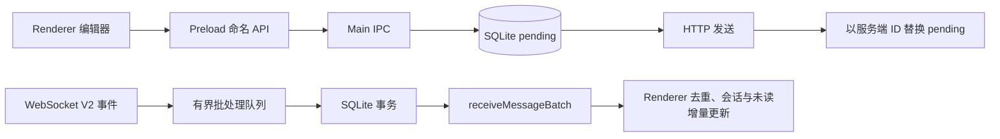

# EasyChat 可靠性与性能说明

EasyChat 是 Electron + Vue 3 + SQLite 的桌面即时通信客户端。本文记录聊天主链路的边界、可验证不变量和发布门禁，便于回归、复盘和面试说明。

## 1. 核心链路



- 发送先持久化 `pending`（状态 `2`），再发 HTTP；HTTP 成功后替换为服务端 `messageId`。本地替换失败进入恢复队列，不能伪造成功。
- 接收事件先批量写入 SQLite，再发布到 renderer；重复 V2 事件由 `processed_event` 去重，游标只在同一事务成功后推进。
- renderer 以 `messageId` 去重，历史加载、搜索和会话切换分别受 `loadSeq`、`searchSeq` 与当前 `sessionId` 保护。
- 上传源、文件读取和下载均经过命名 preload API；renderer 不直接访问 Node.js、文件系统或 SQLite。

## 2. 媒体与下载不变量

- 大于等于 8MB 的文件走现有 4MB 分片上传；上传 ACK、重试和上传源释放按消息维度处理。
- 每个下载任务以 `userId + runtime generation + messageId` 隔离。退出登录或切换用户会取消旧任务，避免进度推送到新 renderer。
- 下载状态按 `messageId` 维护。一个任务完成、失败或取消不会影响其他文件的进度或“接收中”状态。
- 下载仅接受配置的后端源及受校验的重定向；临时 `.download` 文件在失败、取消或运行代次失效时尽力清理。
- 完成下载时使用异步文件重命名，避免被病毒扫描或网络文件夹阻塞 Electron 主进程。

## 3. 性能与可靠性门禁

| 场景 | 门禁 | 对应自动化测试 |
| --- | --- | --- |
| 批量接收 | 5,000 条跨 100 会话消息在 10 秒内真实 SQLite 落库 | `test/main/db/ADB.integration.spec.js` |
| 幂等与未读 | 重放其中 1,000 条后消息数、会话未读数均不增加 | `test/main/db/ADB.integration.spec.js` |
| 长历史 | 10,000 条记录仅计算并渲染视口与 overscan 窗口 | `test/renderer/views/chat/composables/useVirtualMessageList.spec.js` |
| 下载并发 | 两个文件并行下载时，选中消息的状态独立且可取消 | `test/renderer/views/chat/composables/useFileTransfer.spec.js` |
| 主进程 I/O | 下载完成重命名异步执行，再发布成功状态 | `test/main/downloadTaskManager.spec.js` |

运行完整验证：

```bash
npm test
npm run build
npx playwright test --config=playwright.electron.config.mjs
```

## 4. 本地双账号联调清单

使用团队规定的隔离测试环境完成以下人工验收，且不得使用生产数据：

1. 双向文本发送、WebSocket echo、失败重试与应用重启后的 pending 恢复。
2. 图片、视频、普通文件及 8MB 分片边界的上传；分别验证 ACK 先到、后到和重复到达。
3. 并行下载、取消、超时、关闭预览、打开文件和“在文件夹中显示”。
4. 当前会话与后台会话各 1,000 条接收，检查未读、摘要、会话排序和去重。
5. 断线重连、队列溢出和 SQLite 故障后，检查增量同步或快照同步能够恢复。

## 5. 设计取舍与参考

- 选择“本地事务后发布”而不是 renderer 乐观接收：牺牲极少量实时展示延迟，换取可恢复的本地事实来源。
- 选择有界批处理和增量会话 patch，而不是每条消息全量刷新：降低 SQLite/IPC/DOM 放大效应，同时保留溢出后的同步补偿。
- 选择命名业务 API，而不是暴露通用 IPC：保持 Electron 的 `contextIsolation` 与最小权限边界。
- 参考 [Element Web](https://github.com/element-hq/element-web) 的时间线状态组织、[Rocket.Chat Electron](https://github.com/RocketChat/Rocket.Chat.Electron) 的桌面端媒体实践，以及 [Electron Context Isolation 文档](https://www.electronjs.org/docs/latest/tutorial/context-isolation)。只吸收按状态归属、批处理与最小权限的原则，不复制外部代码或引入其复杂架构。

## 6. 面试表述

“我把聊天消息设计成可恢复状态机：发送先写本地 pending，服务端确认后原子替换；接收事件先按批次事务落 SQLite，再推送渲染层。通过事件去重、同步游标、运行代次和有界队列，覆盖重复投递、重连、页面切换和落库失败。对于长列表使用按 messageId 高度缓存的虚拟窗口，并用真实 SQLite 的 5,000 条跨会话回归测试验证消息数和未读数不会因重放而漂移。”
