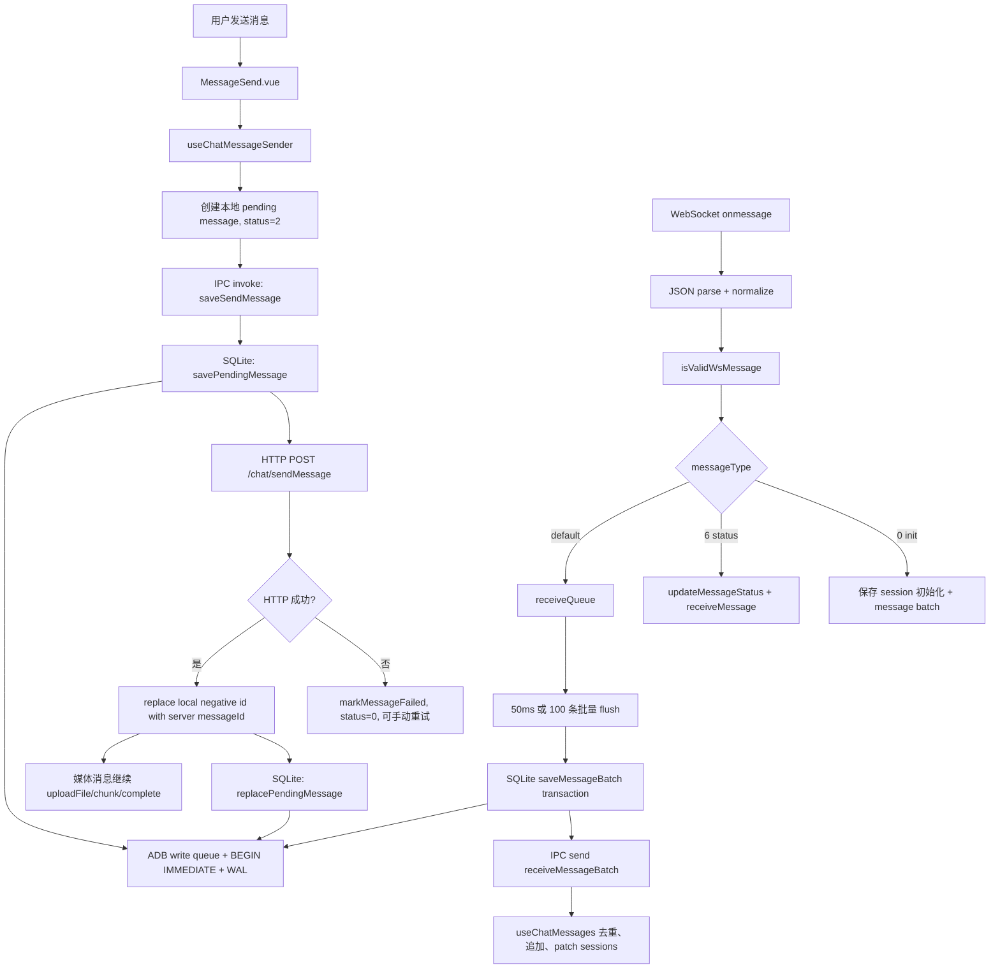
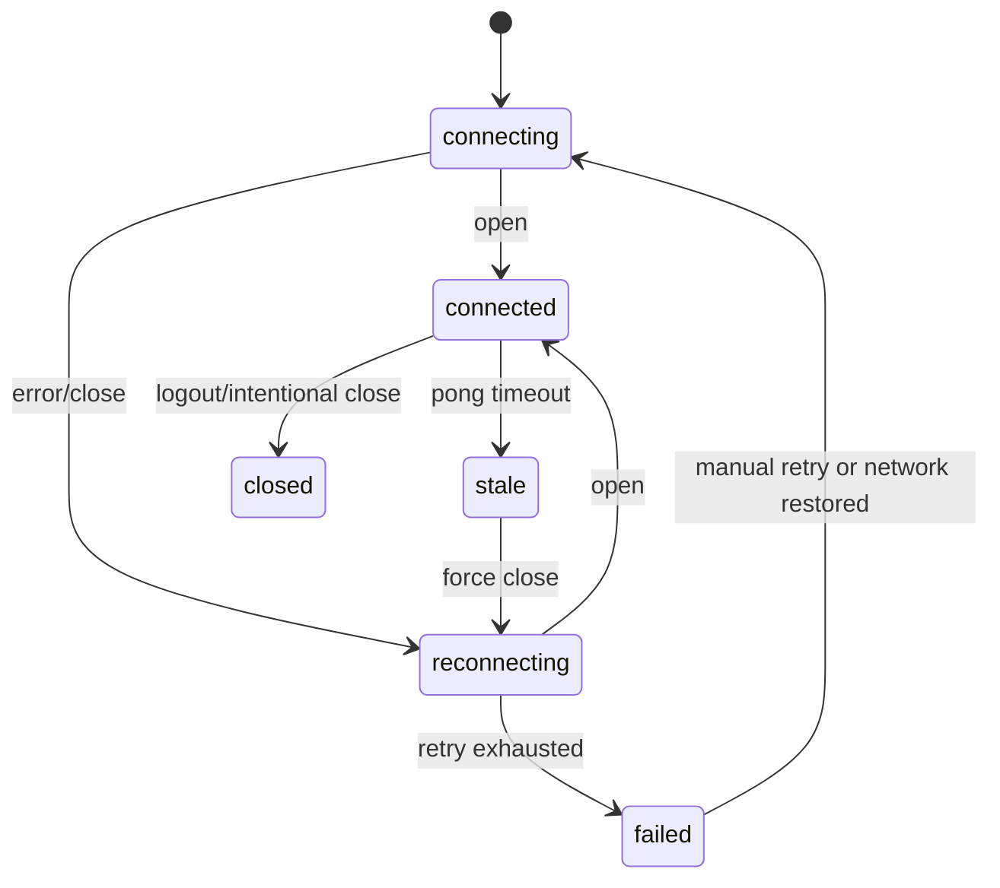

# EasyChat 聊天链路架构与稳定性评估报告

> 评估日期: 2026-06-11  
> 评估范围: 发送链路、接收链路、HTTP 失败处理、WebSocket 断联与重连、SQLite 持久化、IPC 边界、会话状态与 unread 一致性  
> 评估方式: 本地代码只读审计 + 成熟桌面 IM 模式级对标  
> 结论摘要: 当前聊天核心链路已经具备较好的基础可靠性，尤其是本地 pending、批量接收、SQLite 事务写队列、renderer 去重和过期回包防护。但 WebSocket 半开检测、队列阻塞看门狗、SQLite 运维维护、读错误语义、会话乐观更新回滚仍是主要稳定性缺口。

## 1. 对标基准

本报告不声称微信桌面版或开源项目的内部实现细节，只对标成熟桌面 IM 的可靠性模式和用户可感知体验。

参考对象:

- 微信桌面版体验模式: 网络波动时应明确可见、消息失败可重试、历史记录不应因重连或刷新丢失、未读数和会话排序应稳定。
- [Signal Desktop](https://github.com/signalapp/Signal-Desktop): 成熟桌面私信客户端，强调本地持久化、同步恢复、消息状态一致性。
- [Rocket.Chat Electron](https://github.com/RocketChat/Rocket.Chat.Electron): Electron 桌面通信客户端，关注多服务端、连接状态与桌面壳稳定性。
- [Mattermost Desktop](https://github.com/mattermost/desktop): 团队通信桌面端，关注 Web/Electron 边界、服务连接和可恢复体验。
- [Electron IPC 文档](https://www.electronjs.org/docs/latest/tutorial/ipc): IPC 应限制暴露面，renderer/main 之间应有清晰的请求/响应与错误语义。
- [SQLite WAL 文档](https://www.sqlite.org/wal.html): WAL 能提升读写并发，但需要 checkpoint 和故障恢复策略。
- [ws 文档](https://github.com/websockets/ws/blob/master/doc/ws.md): Node WebSocket 客户端通常需要 heartbeat、ping/pong 超时、异常关闭和重连控制。

成熟 IM 桌面端的最低可靠性基线:

- 消息发送必须先进入本地可恢复状态，再尝试网络提交。
- 接收消息必须先持久化，再通知 UI，避免 UI 已显示但本地历史缺失。
- WebSocket 必须能检测半开连接，而不仅是发送 ping。
- 重连必须幂等，不能产生重复 listener、重复 heartbeat 或重复入库。
- SQLite 写入必须有事务边界、忙等待、恢复策略和维护策略。
- 所有跨进程和网络失败都应返回可区分的错误，而不是只返回空数据或 null。

## 2. 当前架构链路



关键代码位置:

- WebSocket 主链路: `src/main/wsClient.js`
- IPC 边界: `src/main/ipc.js`
- SQLite 基础层: `src/main/db/ADB.js`
- 消息模型: `src/main/db/ChatMessageModel.js`
- 会话模型: `src/main/db/ChatSessionUserModel.js`
- HTTP 包装: `src/renderer/src/utils/Request.js`
- 发送 composable: `src/renderer/src/views/chat/composables/useChatMessageSender.js`
- 接收和历史 composable: `src/renderer/src/views/chat/composables/useChatMessages.js`
- 会话 composable: `src/renderer/src/views/chat/composables/useChatSessions.js`

## 3. 综合评分

| 模块 | 评分 | 评价 |
| --- | --- | --- |
| 发送链路 | 4/5 | pending、失败态、重试和媒体上传队列设计扎实；缺断路器、队列上限和发送成功但本地替换失败后的自动补偿。 |
| 接收链路 | 4/5 | 先落库再推 UI、批量队列、去重和 stale generation 防护较好；缺消息处理看门狗和队列刷盘失败后的可恢复策略。 |
| WebSocket 连接 | 3.5/5 | 有 heartbeat、重连、状态通知和重复重连锁；缺 pong 超时检测和半开连接恢复。 |
| SQLite 持久化 | 4/5 | WAL、busyTimeout、写队列、事务边界和去重都较成熟；缺 checkpoint、读错误显式传播、DB 初始化硬失败处理。 |
| IPC 边界 | 3.5/5 | 多数 handler 有安全包装，错误能回调 renderer；仍有部分 fire-and-forget 乐观更新缺少 renderer 回滚消费。 |
| 会话/unread | 3/5 | session patch 增量更新方向正确；mark-read 回滚和置顶失败回滚仍有竞态。 |
| 可观测性 | 2.5/5 | 有 console 日志和 UI toast；缺结构化事件、错误分类、连接状态诊断和 DB 健康指标。 |

整体评分: 3.7/5。  
这是一个已经从“能聊天”走向“可靠聊天”的实现，但距离微信桌面版这类成熟体验仍缺少一层故障探测、恢复确认和可观测性闭环。

## 4. 发送链路评估

### 已具备的稳定性能力

- 本地优先: 发送前先创建负数 `messageId` 的 pending 消息，并通过 `saveSendMessage` 落 SQLite。
- 失败可见: 本地保存失败、HTTP 失败、服务端缺 `messageId` 都会进入 `status=0`，UI 可显示失败并支持手动重试。
- HTTP 成功替换: 成功后用服务端 `messageId` 替换本地临时 id，避免长期保留重复 pending。
- 媒体分阶段: 媒体消息先创建服务端消息，再异步上传文件，上传失败可保留消息态。
- 上传限流: `maxUploadConcurrency = 3`，避免大文件上传同时压垮 renderer 和网络。
- 跨会话防护: 发送/上传期间会校验 active session，避免切换会话后污染当前 UI。

### 主要风险

| 风险 | 等级 | 说明 |
| --- | --- | --- |
| HTTP 成功但本地 replace 失败 | P0 | UI 可能已经替换为成功消息，但 SQLite 仍保留旧 pending 或缺失服务端消息。重启后可能看到失败/重复/缺失。 |
| 发送队列无上限 | P1 | 服务端长时间不可用时，用户连续发送会不断排队和失败，缺少断路器与退避提示。 |
| 上传任务无全局超时 | P1 | 单个上传 Promise 卡住时会长期占用上传并发槽，后续上传被拖慢。 |
| 应用重启后媒体重试不可恢复 | P1 | `retryFile` 仅在内存中，重启后无法继续上传。这可能是设计限制，但应在 UI 和报告中明确。 |
| Request 失败统一返回 null | P1 | 调用方无法区分 HTTP 500、超时、取消、901、网络断开，重试策略无法精细化。 |
| 请求去重 key 依赖 JSON.stringify | P2 | 对对象 key 顺序敏感，且长期运行时需要确认 cache 清理不会因异常路径遗漏。当前实现有 clearDedup，风险较低。 |

### 对标结论

当前发送链路已经接近成熟 IM 的基本做法: 本地 pending + 网络提交 + server id 替换 + 失败可重试。与微信桌面版用户体验相比，主要差距在“发送中断后的解释和恢复”: 成熟体验通常能明确告诉用户是网络失败、登录失效、文件上传失败还是本地存储异常，并尽量保留可恢复上下文。

## 5. 接收链路评估

### 已具备的稳定性能力

- 接收消息进入主进程统一处理，renderer 不直接写 SQLite。
- `normalizeWsMessages` 支持数组、`messages`、`dataList`、`chatMessageList` 等批量结构，并限制递归深度。
- `isValidWsMessage` 在入队前校验 `messageType`、`messageId`、`sessionId`。
- 普通消息进入 `receiveQueue`，满足 50ms 或 100 条时批量刷盘。
- `saveMessageBatch` 在一个事务内完成可见性过滤、去重、session upsert、unread 累加和消息插入。
- SQLite 保存成功后再 `receiveMessageBatch` 推送 renderer。
- renderer 使用 `messageIdSet` 去重，并通过 `loadSeq` 和 sessionId 丢弃过期历史回包。
- `wsRuntimeGeneration` 能避免重连/reset 后旧 flush 继续推送到已失效窗口。

### 主要风险

| 风险 | 等级 | 说明 |
| --- | --- | --- |
| `messageProcessingQueue` 无看门狗 | P0 | 如果某次消息处理 Promise 永久不 resolve，后续所有 WS 消息都会卡住。概率低，但影响极大。 |
| receive queue 溢出直接丢旧消息 | P0 | 2000 条以上时会丢弃最老消息并通知 UI，但缺少后续自动补偿拉取。成熟 IM 应在丢弃后触发历史同步或全量补偿。 |
| 重连前 flush 不等待确认 | P1 | reset 前异步刷盘，generation 变化会阻止 renderer push，但 DB 成功与否不透明。依赖后续 init 补推，存在短窗口风险。 |
| JSON parse 失败只日志丢弃 | P2 | 单条坏消息不会影响链路，这是合理的；但缺少错误计数和诊断事件。 |
| status ack 与普通消息顺序 | P2 | type=6 会先 flush queue，再更新状态，方向正确；仍需要测试 ack 早于本地 replace 的竞态。 |

### 对标结论

接收链路的“先入库再推 UI”是正确方向，优于只在 renderer 内存里 append 的脆弱实现。与成熟 IM 相比，短板在“异常批量处理后的恢复”: 队列满、刷盘失败、处理卡死后应进入明确的 resync 或 degraded 状态，而不是只 toast 或 console。

## 6. WebSocket 专项评估

### 当前机制

- 连接地址从本地 store 的 `devWsDomain` 或 `prodWsDomain` 获取。
- token 通过 query string 拼接到 ws url。
- 建连后发布 `wsStatusChange: connected`，断线时发布 reconnecting/failed。
- heartbeat 每 10 秒执行 `ws.ping()`。
- 重连最多 5 次，每次间隔 5 秒。
- `lockReconnect` 防止并发重连。
- `closeWs()` 设置 `needReconnect=false`，防止主动关闭后自动重连。
- `onerror` 只发布状态，不直接重连，避免与 `onclose` 双重触发。

### 主要风险

| 风险 | 等级 | 说明 |
| --- | --- | --- |
| 缺 pong 超时检测 | P0 | 只发送 ping 不验证 pong，无法快速发现半开连接。TCP 长超时期间用户会以为在线，但收不到消息。 |
| 重连没有指数退避 | P1 | 固定 5 秒和 5 次适合短故障，但对长故障体验一般。成熟 IM 通常先快后慢，并允许手动重连。 |
| 连接失败状态缺少恢复入口 | P1 | 状态能发布 failed，但 UI 是否展示并允许用户点击重连需要进一步确认。 |
| token 在 query 中 | P2 | WebSocket 常见做法，但日志和代理层可能泄漏。需要确认生产日志不会打印完整 wsUrl。 |
| domain 缺失静默跳过连接 | P2 | `missing devWsDomain/prodWsDomain` 只 console，不通知 renderer。配置错误时用户只会感知离线。 |

### 建议目标

WebSocket 应形成以下状态机:



## 7. SQLite 专项评估

### 已具备的稳定性能力

- SQLite 位于用户目录，dev/prod 数据库隔离。
- `db.configure('busyTimeout', 5000)` 降低短暂锁冲突失败概率。
- 启用 `PRAGMA journal_mode=WAL` 和 `PRAGMA synchronous=NORMAL`。
- 所有写操作通过 Promise 写队列串行化。
- `runInTransaction` 使用 `BEGIN IMMEDIATE`，事务内利用 `AsyncLocalStorage` 避免重复入队。
- `saveMessageBatch` 将 dedup SELECT 和 INSERT 放入同一事务，降低 TOCTOU 竞态。
- 清空聊天时写入 `chat_session_clear` 游标，再删除当前可见消息，后续补推会被过滤。
- 有索引支持会话消息分页和会话列表排序:
  - `idx_chat_message_user_session_message`
  - `idx_chat_session_user_sort`

### 主要风险

| 风险 | 等级 | 说明 |
| --- | --- | --- |
| DB 初始化失败后继续运行 | P0 | `dbReady` 只 catch console，调用方没有统一等待或熔断。初始化失败可能导致后续读空、写失败、状态错乱。 |
| 读错误返回空数据 | P0 | `queryAll/queryOne/queryCount` 出错时返回 `[]/null/0`，调用方无法区分“没有数据”和“数据库故障”。这会掩盖严重问题。 |
| WAL 无 checkpoint 策略 | P1 | 长期使用后 WAL 文件可能增大。SQLite WAL 需要合理 checkpoint 或维护时机。 |
| clear message 和 clear session summary 分离 | P1 | `clearMessageBySessionId` 与 `clearChatSessionSummaryBySessionId` 不在同一事务，部分失败会导致消息清了但会话摘要未清，或反过来。 |
| 搜索未使用 FTS | P2 | 当前 `LIKE` 搜索在大历史量下会慢。短期可接受，长期应考虑 FTS5 或后台索引。 |
| pending 消息缺少重启恢复策略 | P2 | status=2 的孤儿 pending 可以保留，但需要启动时转换为 failed 或提供恢复判断。 |

### 对标结论

当前 SQLite 写入层比普通 demo 项目成熟很多，尤其是串行写队列和事务边界。但成熟 IM 客户端还需要“数据库不可用时的显式降级”: 本地库坏了、磁盘满了、WAL 失控、初始化失败，都应触发可诊断状态，而不是让 UI 看起来像空列表。

## 8. IPC 与 Electron 边界评估

### 已具备的稳定性能力

- 大量 IPC 使用 `registerSafeIpcOn` 包装，异常会以 `{ success:false, error }` 回调 renderer。
- `saveSendMessage` 使用 `ipcMain.handle`，发送链路能 await 本地保存结果。
- `sendToRenderer` 会检查 `webContentsSender.isDestroyed`，避免向销毁窗口发送。
- renderer 注册消息 listener 前会先 remove，避免重复监听。

### 主要风险

| 风险 | 等级 | 说明 |
| --- | --- | --- |
| preload 暴露完整 ipcRenderer | P1 | `AGENTS.md` 指出 context isolation 关闭且直接暴露 ipcRenderer。稳定性和安全性都弱于白名单 API。 |
| 部分乐观操作没有回滚消费 | P1 | `topChatSessionCallback` 主进程会发，但 renderer 目前重点处理 mark-read 回调，置顶失败可能无法恢复。 |
| send/on 回调风格不统一 | P2 | 有 `send + callback channel`，也有 `invoke/handle`。长期维护时容易漏错误处理。 |
| IPC 错误 shape 不完全统一 | P2 | 有些 callback 有 `channel`，有些只有 `success/error`。建议统一诊断字段。 |

## 9. 会话状态与 unread 评估

### 已具备的稳定性能力

- 会话列表按置顶和 lastReceiveTime 排序。
- receive batch 带 session patch，避免每条消息都全量 reload。
- 当前会话收到消息后会 mark read，并通过 `readContactIds` 修正本地 unread。
- mark-read 有 5 秒回滚机制，主进程成功后清理 pending。
- session upsert 会保留已有 `noReadCount` 和 `topType`，避免 init 或消息 patch 覆盖用户状态。

### 主要风险

| 风险 | 等级 | 说明 |
| --- | --- | --- |
| mark-read 回滚竞态 | P1 | 5 秒内如果有新的 session patch 覆盖 generation，失败回滚可能被跳过，导致 unread 永久显示 0。 |
| remove listener 清理 pending read | P1 | 组件卸载时清理定时器，未完成 mark-read 无法回滚。切换页面或重建组件时可能隐藏失败。 |
| 置顶失败无 UI 回滚 | P1 | 本地先乐观更新，主进程失败时用户可能看到错误排序。 |
| session patch 和当前会话同步复杂 | P2 | 当前逻辑已经比较小心，但后续改动容易破坏 contactId/sessionId 双重判断。需要测试护栏。 |

## 10. 风险分级总表

### P0: 应优先修复

| 编号 | 问题 | 影响 | 建议 |
| --- | --- | --- | --- |
| P0-1 | WebSocket 缺 pong 超时检测 | 半开连接期间收不到消息且用户误以为在线 | 增加 pong deadline，超时后主动 terminate/close 并进入 reconnecting。 |
| P0-2 | `messageProcessingQueue` 无看门狗 | 单条处理卡死会阻塞全部接收 | 为每个处理任务加超时、错误隔离和队列恢复事件。 |
| P0-3 | receive queue 溢出后无自动补偿 | 高峰消息可能永久丢失本地历史 | 溢出后标记 session 需要 resync，重连或空闲时按 session 拉历史补偿。 |
| P0-4 | DB 读错误被伪装为空数据 | 数据库故障会被 UI 当作无历史/无会话 | 增加 strict read 或 `{ success:false }` 错误返回，关键读路径不得吞错。 |
| P0-5 | HTTP 成功但本地 replace 失败缺恢复 | 重启后可能出现 pending/重复/缺失 | 记录 replace failure，启动或下次打开会话时按 server id 修复。 |

### P1: 稳定性和体验修复

| 编号 | 问题 | 影响 | 建议 |
| --- | --- | --- | --- |
| P1-1 | WAL 无 checkpoint | 长期运行可能导致 WAL 增大和磁盘压力 | 增加定时或退出前 checkpoint，并监控 wal 文件大小。 |
| P1-2 | DB 初始化失败无熔断 | 后续功能异常但用户不可诊断 | 所有 DB API 等待 `dbReady`，失败时返回明确错误并提示本地数据库不可用。 |
| P1-3 | clear 消息和会话摘要事务分离 | 清空聊天可能出现摘要不一致 | 合并到同一模型事务或提供单一 IPC handler 内事务函数。 |
| P1-4 | Request 返回 null 过于粗糙 | 发送/上传无法区分错误类型 | 引入兼容模式错误对象，如 `{ success:false, kind, code, message }`。 |
| P1-5 | 上传任务无超时 | 上传卡住占用并发槽 | 为单文件、单 chunk 和 complete 增加 timeout 与取消恢复。 |
| P1-6 | mark-read 回滚竞态 | unread 可能永久错误 | 回滚逻辑引入操作 id，失败回包只回滚对应操作，不被无关 patch 覆盖。 |
| P1-7 | 置顶失败无回滚 | 会话排序和真实 DB 状态不一致 | renderer 监听 `topChatSessionCallback` 并按失败恢复。 |

### P2: 长期质量和可观测性

| 编号 | 问题 | 影响 | 建议 |
| --- | --- | --- | --- |
| P2-1 | 缺结构化连接诊断 | 线上问题难复盘 | 记录 ws status、retry count、queue size、last pong、db error count。 |
| P2-2 | 搜索 LIKE 扫描 | 大历史下搜索慢 | 引入 FTS5 或维护轻量搜索索引。 |
| P2-3 | IPC 风格不统一 | 后续维护容易漏错误 | 新增 IPC 使用 `invoke/handle` 或统一 callback shape。 |
| P2-4 | 注释/文档编码显示异常 | 可维护性下降 | 统一文件编码为 UTF-8，修复已有乱码文档和注释。 |
| P2-5 | 缺 pending 启动恢复 | 重启后发送中消息语义不清 | 启动扫描 status=2，按时间和消息类型转 failed 或恢复上传。 |

## 11. 建议修复路线

### 第一阶段: 保消息不丢，保连接真实

目标: 解决最可能造成消息丢失或链路停摆的问题。

- 为 WebSocket heartbeat 增加 pong deadline:
  - ping 后设置 `lastPongAt` 或 `pongTimer`。
  - 超过 2 个 heartbeat 未收到 pong 时主动关闭 socket。
  - 发布 `wsStatusChange: stale/reconnecting`。
- 为 `messageProcessingQueue` 增加 per-message timeout:
  - 超时后记录错误，跳过当前消息或进入 failed queue。
  - 后续消息不能被永久阻塞。
- receive queue 溢出后触发 resync 标记:
  - 按 session 标记 `needsHistorySync`。
  - 下次 reconnect init 或用户打开会话时主动拉取缺口。
- DB 读错误显式化:
  - 关键读路径从静默 `[]/null/0` 改为可识别错误结果。
  - IPC callback 向 renderer 传 `{ success:false, error }`。

### 第二阶段: 保状态一致，保恢复体验

目标: 修复用户可见的不一致和失败恢复。

- HTTP 成功但 replace 失败时记录补偿任务。
- mark-read 和 top session 增加完整回调消费和失败回滚。
- clear message + clear session summary 合并事务。
- Request 保留旧 `null` 兼容，同时新增错误详情供新调用方使用。
- 上传任务增加 timeout、abort、重试退避和失败分类。

### 第三阶段: 运维化和可观测

目标: 让问题能被定位、衡量和回归测试。

- 增加 SQLite WAL checkpoint 维护策略。
- 增加 DB health 状态和磁盘/初始化错误提示。
- 记录结构化事件:
  - WS connect/reconnect/failed/stale
  - receive queue size/drop count
  - db read/write failure
  - pending replace failure
  - upload timeout/cancel/failure
- 修复文档和注释编码，避免知识资产不可读。

## 12. 当前测试覆盖评估

已存在并建议保留的测试:

- `test/main/wsClient.spec.js`
  - 覆盖消息 normalize、递归深度、基础 message 校验。
- `test/main/db/ChatMessageModel.spec.js`
  - 覆盖 pending、replace、去重、可见消息过滤、基础查询边界。
- `test/main/ipc.spec.js`
  - 覆盖主要 IPC handler、错误包装、文件下载基础路径。
- `test/renderer/views/chat/composables/useChatMessages.spec.js`
  - 覆盖 batch 接收、过期回包、失败 batch、自己消息 echo 合并、listener 幂等。
- `test/main/stress/chatMessageStress.spec.js`
  - 覆盖高并发写队列、批量保存、队列溢出模拟、多 session 洪峰、吞吐量。

建议新增测试:

| 场景 | 类型 | 验收标准 |
| --- | --- | --- |
| WebSocket pong 超时 | unit/integration | 未收到 pong 时进入 reconnecting，且不会重复创建 timer。 |
| messageProcessingQueue 卡死 | unit | 单条消息超时后后续消息仍能处理。 |
| receive queue 溢出补偿 | unit/integration | dropped 后 session 被标记需要 resync。 |
| DB 初始化失败 | unit | IPC 返回明确错误，renderer 不把它当作空会话。 |
| queryAll 读错误 | unit | 关键查询能返回错误态或抛给 safe IPC。 |
| HTTP 500/timeout/901 | unit | 发送链路区分失败类型，901 触发 logout，其余保留 retry。 |
| replacePendingMessage 失败 | unit | UI 不误判本地持久化成功，补偿任务被记录。 |
| markSessionRead 失败竞态 | renderer unit | 新消息 patch 后失败回滚不会覆盖真实新 unread。 |
| topChatSession 失败 | renderer unit | 本地排序能回滚到前一状态。 |
| WAL checkpoint | unit/manual | 维护函数执行失败可观测，成功时不影响正常读写。 |

可选验证命令:

```bash
npm test
npm run build
```

本次评估未执行测试和构建，因为任务目标是产出报告与修复清单，不修改业务逻辑。

## 13. 后续接口影响说明

本报告不要求立即修改现有 API、IPC channel、SQLite schema 或 WebSocket payload。若进入修复阶段，下列改动可能影响接口或兼容性，需要单独评审:

- `wsStatusChange` 增加 `stale`、`manualRetryAvailable`、`lastPongAt` 等字段。
- `receiveMessageBatch` 失败 payload 增加错误分类，如 `kind: "db_write_failed" | "queue_overflow" | "resync_required"`。
- SQLite 增加 health/checkpoint 维护接口。
- HTTP Request 从 `null` 失败升级为结构化错误对象时，需要兼容旧调用方。
- pending 恢复可能需要新增本地字段或迁移策略。

## 14. 最终结论

EasyChat 当前聊天链路的主干是健康的: 发送端有本地 pending 和失败态，接收端有批量落库和去重，SQLite 有事务写队列，renderer 有过期回包防护。这些都是成熟 IM 的正确方向。

最需要补齐的是故障闭环:

1. 连接必须能识别“看起来连着但实际不可用”的半开状态。
2. 接收队列必须避免被单条消息或 DB 异常永久阻塞。
3. SQLite 错误必须显式暴露，不能伪装成空数据。
4. 所有乐观 UI 状态都要有成功确认和失败回滚。
5. 高峰或溢出后要能自动补偿，而不是只提示丢弃。

按上述 P0/P1 修完后，EasyChat 的聊天链路稳定性会从“本地架构扎实”提升到“网络波动和异常场景下也可信”。
