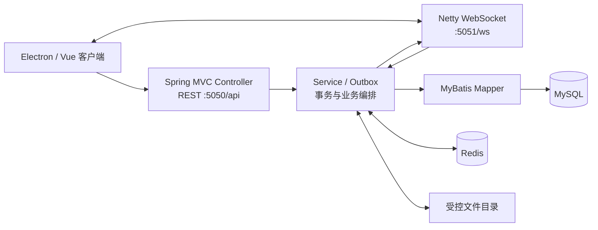

# EasyChat 单仓库后端架构与迁移设计

## 架构目标

将最近维护的 Java 后端作为 `backend/` 纳入与 Electron 客户端相同的 Git 仓库，保持 HTTP `:5050/api`、WebSocket `:5051/ws`、消息状态和 V2 可靠事件协议不变。目标是让客户端、服务端、数据库迁移和运行说明可在一个提交中审阅、构建和回滚。

## 约束与非目标

- 保留 Spring Boot + MyBatis + MySQL + Redis + Netty 的既有技术栈，不引入新框架。
- 保留 `com.easychat` 的包和 API 路径，避免破坏桌面端调用。
- 运行配置只经环境变量提供；凭据、日志、构建产物和 Redis RDB 不进 Git。
- 不在本次迁移中拆成微服务，也不改变数据库 schema 或 V2 事件语义。

## 现状与参考

原后端已有清晰的 Controller、Service、Mapper、Redis 和 WebSocket 边界，以及 V2 outbox 与 schema readiness 校验；但它位于客户端仓库之外，难以在同一变更中复核客户端协议、迁移 SQL 和服务端实现。

[OpenIM Server](https://github.com/openimsdk/open-im-server) 将 API、WebSocket、存储、部署配置和运维文档作为明确边界；其 [环境配置文档](https://github.com/openimsdk/open-im-server/blob/main/docs/contrib/environment.md) 也将数据目录、配置目录和服务端口显式化。EasyChat 借鉴这些“边界清晰、配置外置、部署可复现”的做法，但不照搬其面向大规模集群的微服务/RPC 架构：当前桌面端本地开发与单节点部署采用模块化单体风险更低。

## 目标边界

```text
仓库根目录
├── EasyChat/                     Electron + Vue 客户端
├── backend/                      Java 服务及后端测试
│   ├── controller/               REST 入站适配层
│   ├── service/                  业务编排、事务、可靠事件 owner
│   ├── mappers/                  MyBatis 持久化边界
│   ├── redis/                    Redis / Redisson 适配层
│   ├── websocket/                Netty 鉴权、连接与事件推送
│   └── src/main/resources/       应用配置、Mapper XML、迁移顺序
└── docs/                         跨端架构与迁移决策
```

`backend/easychat.sql` 是初始 schema；增量可靠事件迁移仍与应用资源一起保留，防止迁移文件和运行时 schema 校验脱节。

## 数据与控制流



HTTP、WebSocket 的输入验证和错误语义停留在传输层；跨表写入、outbox 创建与可恢复状态由 Service 负责；Mapper 只负责 MySQL 查询与写入；Redis/Redisson 与文件系统由各自适配层隔离。消息的“先落库、再投递”顺序和客户端的本地 pending/replace 语义保持不变。

## 接口与 Schema 兼容性

- 客户端默认 `VITE_API_ORIGIN` 对应 `http://localhost:5050`，`VITE_WS_ORIGIN` 对应 `ws://localhost:5051/ws`；本次不改路径、端口或请求模型。
- 后端仍以 `/api` 为 servlet context path，WebSocket 仍走独立 Netty 端口。
- 上线 V2 可靠事件前，必须按 `src/main/resources/MIGRATION_ORDER.md` 的顺序执行 SQL。应用启动时的 schema readiness 校验是发布检查点，不得在生产环境关闭。
- 迁移回滚为停止新版本、恢复到前一已验证服务版本，并依据已执行 SQL 的可逆性单独处理数据；不能用删除表作为通用回滚手段。

## 方案取舍

| 方案 | 结论 | 原因 |
| --- | --- | --- |
| 原样保留外部后端 | 不采用 | 客户端协议、服务端与迁移无法原子审阅和提交。 |
| 迁入 `backend/` 的模块化单体 | 采用 | 保持现有行为，单仓库协作与本地启动成本最低。 |
| 直接拆分为微服务 | 暂不采用 | 当前没有独立部署、服务发现、队列和可观测性基础；会扩大协议和运维风险。 |

## 迁移与验证计划

1. 将 `easychat-java` 的 `src/`、`pom.xml` 和初始 schema 迁入 `backend/`；不纳入 `target/`、日志或数据文件。
2. 核对 V2 outbox、schema validator、迁移 SQL 的哈希，确保迁入的是最近维护版本。
3. 在 `backend/` 执行 Maven 测试和打包；在 `EasyChat/` 执行构建，确认客户端运行时地址契约未变。
4. 本地联调至少覆盖登录、HTTP 请求、WebSocket 建连、文本消息、失败重试与 schema readiness。
5. 提交时仅暂存 `backend/`、架构文档、README 和忽略规则，排除现有运行日志与任何本机配置。
